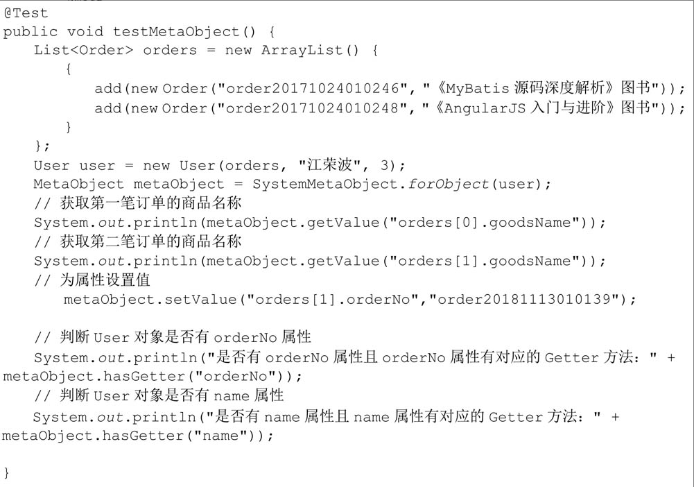
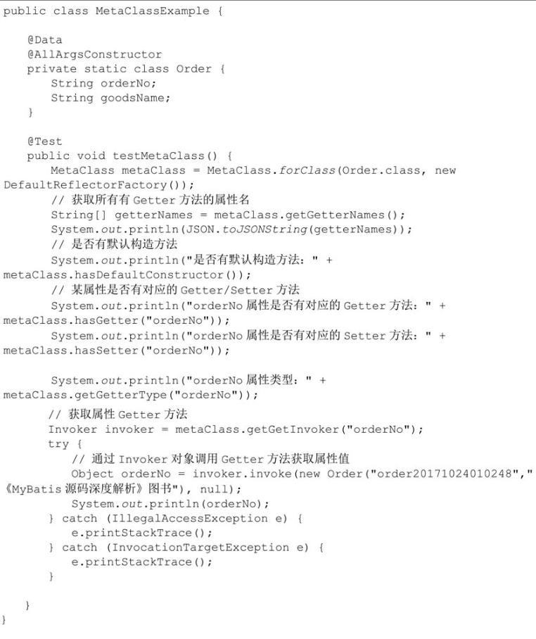
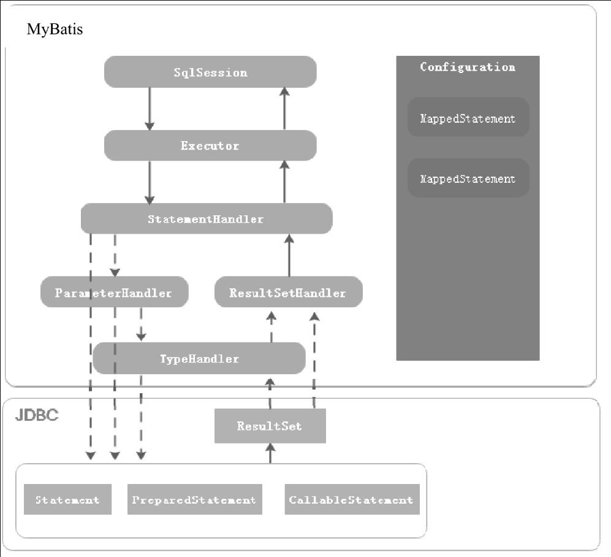
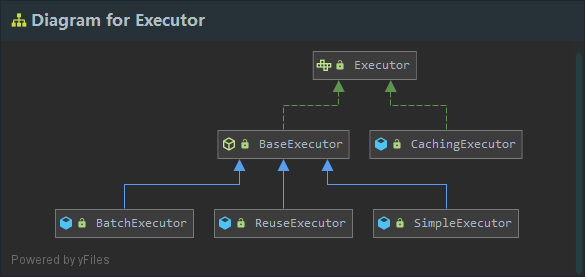
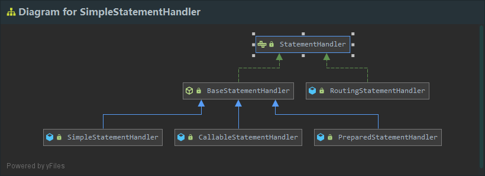
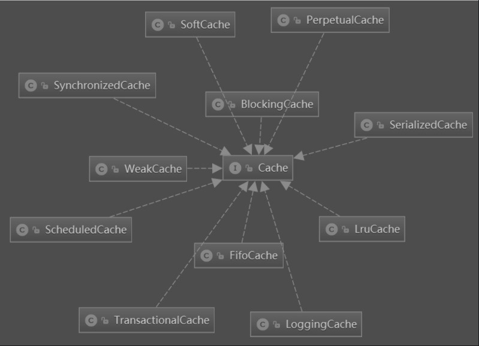
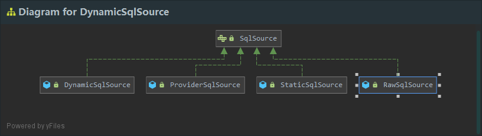
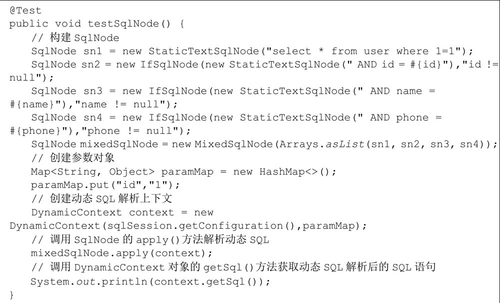

# 工具类

## SQL

        `SQL`工具类。可以很方便地在`Java`代码中动态构建`SQL`语句。

```java
//SELECT id,name FROM user WHERE (id = #{id} AND name = #{name}) 
// OR (name is null)
SQL sql = new SQL(){{
            SELECT("id,name");
            FROM("user");
            WHERE("id = #{id}");
            WHERE("name = #{name}");
            OR();
            WHERE("name is null");
}};
```

        `SQL`继承自`AbstractSQL`只重写了该类的`getSelf()`方法：

```java
public class SQL extends AbstractSQL<SQL> {
  @Override
  public SQL getSelf() {
    return this;
  }
}
```

        `AbstractSQL`类中维护了一个`SQLStatement`内部类的实例和一系列构造`SQL`语句的方法。

```java
public abstract class AbstractSQL<T> {

  private static final String AND = ") \nAND (";
  private static final String OR = ") \nOR (";

  private final SQLStatement sql = new SQLStatement();

  public abstract T getSelf();

  public T SELECT(String... columns) {
    sql().statementType = SQLStatement.StatementType.SELECT;
    sql().select.addAll(Arrays.asList(columns));
    return getSelf();
  }

  public T SELECT_DISTINCT(String columns) {
    sql().distinct = true;
    SELECT(columns);
    return getSelf();
  }

  ...
}
```

        `SQLStatement`内部类用于描述一个`SQL`语句，该类中通过`StatementType`确定SQL语句的类型。`SQLStatement`类中还维护了一系列的`ArrayList`属性，当调

用`SELECT(、UPDATE()`等方法时，这些方法的参数内容会记录在这些`ArrayList`对象中：

```java
private static class SQLStatement {

    public enum StatementType {
      DELETE, INSERT, SELECT, UPDATE
    }

    StatementType statementType;
    List<String> sets = new ArrayList<>();
    List<String> select = new ArrayList<>();
    List<String> tables = new ArrayList<>();
    List<String> join = new ArrayList<>();
    List<String> innerJoin = new ArrayList<>();
    List<String> outerJoin = new ArrayList<>();
    List<String> leftOuterJoin = new ArrayList<>();
    List<String> rightOuterJoin = new ArrayList<>();
    List<String> where = new ArrayList<>();
    List<String> having = new ArrayList<>();
    List<String> groupBy = new ArrayList<>();
    List<String> orderBy = new ArrayList<>();
    List<String> lastList = new ArrayList<>();
    List<String> columns = new ArrayList<>();
    List<List<String>> valuesList = new ArrayList<>();
    boolean distinct;
    String offset;
    String limit;

    ...
}
```

        `AbstrastSQL`类重写了`toString()`方法，该方法中会调用`SQLStatement`对象的`sql()`方法生成`SQL`字符串：

```java
// AbstractSQL 类
public String toString() {
    StringBuilder sb = new StringBuilder();
    sql().sql(sb);
    return sb.toString();
}
```

```java
// SQLStatement 类
public String sql(Appendable a) {
      SafeAppendable builder = new SafeAppendable(a);
      if (statementType == null) {
        return null;
      }

      String answer;

      switch (statementType) {
        case DELETE:
          answer = deleteSQL(builder);
          break;

        case INSERT:
          answer = insertSQL(builder);
          break;

        case SELECT:
          answer = selectSQL(builder);
          break;

        case UPDATE:
          answer = updateSQL(builder);
          break;

        default:
          answer = null;
      }

      return answer;
}


private String selectSQL(SafeAppendable builder) {
      // 追加 select 子句
      if (distinct) {
        sqlClause(builder, "SELECT DISTINCT", select, "", "", ", ");
      } else {
        sqlClause(builder, "SELECT", select, "", "", ", ");
      }
      // 追加 from 子句
      sqlClause(builder, "FROM", tables, "", "", ", ");
      // 追加 join 子句
      joins(builder);
      // 追加 where 子句
      sqlClause(builder, "WHERE", where, "(", ")", " AND ");
      // 追加 group by 子句
      sqlClause(builder, "GROUP BY", groupBy, "", "", ", ");
      // 追加 having 子句
      sqlClause(builder, "HAVING", having, "(", ")", " AND ");
      // 追加 order by 子句
      sqlClause(builder, "ORDER BY", orderBy, "", "", ", ");
      limitingRowsStrategy.appendClause(builder, offset, limit);
      return builder.toString();
}


private void sqlClause(SafeAppendable builder, String keyword, List<String> parts, String open, String close,
                           String conjunction) {
      if (!parts.isEmpty()) {
        if (!builder.isEmpty()) {
          builder.append("\n");
        }
        // 拼接 SQL 关键字
        builder.append(keyword);
        builder.append(" ");
        // 拼接关键字后开始字符
        builder.append(open);
        String last = "________";
        for (int i = 0, n = parts.size(); i < n; i++) {
          String part = parts.get(i);
          // 如果 SQL 关键字对应的子句内容不为 or 或 and ，则追加连接关键字
          if (i > 0 && !part.equals(AND) && !part.equals(OR) && !last.equals(AND) && !last.equals(OR)) {
            builder.append(conjunction);
          }
          // 追加子句内容
          builder.append(part);
          last = part;
        }
        // 追加关键字后结束字符
        builder.append(close);
      }
}
```

## ScriptRunner

        `ScriptRunner`工具类用于读取脚本文件中的`SQL`语句并执行。`ScriptRunner`工具类的构造方法需要一个`java.sql.Connection`对象作为参数。创建

`ScriptRunner`对象后，调用该对象的`runScript()`方法即可，该方法接收一个读取`SQL`脚本文件的`Reader`对象作为参数：

```java
try {
    Connection con = DriverManager.getConnection("jdbc:mysql://127.0.0.1:3306/db", "root", "123456");
    ScriptRunner runner = new ScriptRunner(con);
    runner.runScript(Resources.getResourceAsReader("xxx.sql"));
}
catch (Exception e){
    e.printStackTrace();
}
```

        `ScriptRunner`工具类中提供了一些属性，用于控制执行`SQL`脚本的一些行为：

```java
public class ScriptRunner {

  // SQL 异常是否中断程序执行
  private boolean stopOnError;

  // 是否抛出 SQLWarning 警告
  private boolean throwWarning;

  // 是否自动提交
  private boolean autoCommit;

  // 为 true ，批量执行文件中的 SQL 语句
  // 为 false，逐条执行 SQL 语句，默认情况下，SQL 语句以分号分隔
  private boolean sendFullScript;

  // 是否去除 Windows 系统换行符中的 \r
  private boolean removeCRs;

  // 设置 Statement 属性是否支持转义处理
  private boolean escapeProcessing = true;
  // 日志输出位置
  private PrintWriter logWriter = new PrintWriter(System.out);

  // 错误日志输出位置
  private PrintWriter errorLogWriter = new PrintWriter(System.err);
  // 脚本中 SQL 语句的分隔符，默认为分号
  private String delimiter = DEFAULT_DELIMITER;

  // 是否支持 SQL 语句分隔符单独占一行
  private boolean fullLineDelimiter;

  ...
}
```

        上面的属性，可以使用对应的 `Setter`方法来设置。`ScriptRunner`仅提供了一个`runScript`方法用于执行`SQL`脚本文件：

```java
// ScriptRunner 类
public void runScript(Reader reader) {
    // 设置事务是否自动提交
    setAutoCommit();

    try {
      if (sendFullScript) {
        // 一次性批量执行
        executeFullScript(reader);
      } else {
        // 逐条执行
        executeLineByLine(reader);
      }
    } finally {
      rollbackConnection();
    }
}


private void executeLineByLine(Reader reader) {
    StringBuilder command = new StringBuilder();
    try {
      BufferedReader lineReader = new BufferedReader(reader);
      String line;
      while ((line = lineReader.readLine()) != null) {
        // 处理每行内容
        handleLine(command, line);
      }
      commitConnection();
      checkForMissingLineTerminator(command);
    } catch (Exception e) {
      String message = "Error executing: " + command + ".  Cause: " + e;
      printlnError(message);
      throw new RuntimeSqlException(message, e);
    }
}


private void handleLine(StringBuilder command, String line) throws SQLException {
    String trimmedLine = line.trim();
    // 判断该行是否是 SQL 注释
    if (lineIsComment(trimmedLine)) {
      Matcher matcher = DELIMITER_PATTERN.matcher(trimmedLine);
      if (matcher.find()) {
        delimiter = matcher.group(5);
      }
      println(trimmedLine);
    }
    // 判断该行是否包含分号 
    else if (commandReadyToExecute(trimmedLine)) {
      // 获取分号之前的内容
      command.append(line, 0, line.lastIndexOf(delimiter));
      command.append(LINE_SEPARATOR);
      println(command);
      // 执行完整的 SQL 语句
      executeStatement(command.toString());
      command.setLength(0);
    }
    // 不包含分号，说明 SQL 语句未结束，追加到本行内容到之前读取的内容中 
    else if (trimmedLine.length() > 0) {
      command.append(line);
      command.append(LINE_SEPARATOR);
    }
}
```

## SqlRunner

        `SqlRunner`工具类对`JDBC`做了很好的封装，结合`SQL`工具类，能够很方便地通过`Java`代码执行`SQL`语句并检索`SQL`执行结果。

        方法：

                `closeConnection`：用于关闭`Connection`对象。

                `selectOne`：执行`SELECT`语句，`SQL`语句中可以使用占位符，如果`SQL`中包含占位符，则可变参数用于为参数占位符赋值，该方法只返回一条记录。若

​		查询结果行数不等于一，则会抛出`SQLException`异常。

                `selectAll`：该方法和`selectOne()`方法的作用相同，只不过该方法可以返回多条记录，方法返回值是一个`List`对象，`List`中包含多个`Map`对象，每

​		个`Map`对象对应数据库中的一行记录。

                `insert`：执行一条`INSERT`语句，插入一条记录。

                `update`：更新若干条记录。

                `delete`：删除若干条记录。

                `run`：执行任意一条`SQL`语句，最好为`DDL`语句。

```java
// SqlRunner 类
public List<Map<String, Object>> selectAll(String sql, Object... args) throws SQLException {
    try (PreparedStatement ps = connection.prepareStatement(sql)) {
      // 设置 SQL 中的占位符
      setParameters(ps, args);
      // 执行查询操作
      try (ResultSet rs = ps.executeQuery()) {
        // 将查询结果转化为 List
        return getResults(rs);
      }
    }
}


private void setParameters(PreparedStatement ps, Object... args) throws SQLException {
    for (int i = 0, n = args.length; i < n; i++) {
      if (args[i] == null) {
        throw new SQLException("SqlRunner requires an instance of Null to represent typed null values for JDBC compatibility");
      } else if (args[i] instanceof Null) {
        ((Null) args[i]).getTypeHandler().setParameter(ps, i + 1, null, ((Null) args[i]).getJdbcType());
      } else {
        // 根据参数类型获取对应的 TypeHandler
        TypeHandler typeHandler = typeHandlerRegistry.getTypeHandler(args[i].getClass());
        if (typeHandler == null) {
          throw new SQLException("SqlRunner could not find a TypeHandler instance for " + args[i].getClass());
        } else {
          // 为占位符赋值
          typeHandler.setParameter(ps, i + 1, args[i], null);
        }
      }
    }
}


private List<Map<String, Object>> getResults(ResultSet rs) throws SQLException {
    List<Map<String, Object>> list = new ArrayList<>();
    List<String> columns = new ArrayList<>();
    List<TypeHandler<?>> typeHandlers = new ArrayList<>();
    // 获取 ResultSetMetaData 对象，通过 ResultSetMetaData 获取所有列名
    ResultSetMetaData rsmd = rs.getMetaData();
    for (int i = 0, n = rsmd.getColumnCount(); i < n; i++) {
      columns.add(rsmd.getColumnLabel(i + 1));
      try {
        // 获取类的 JDBC 类型
        Class<?> type = Resources.classForName(rsmd.getColumnClassName(i + 1));
        // 根据类型获取对应的 TypeHandler
        TypeHandler<?> typeHandler = typeHandlerRegistry.getTypeHandler(type);
        if (typeHandler == null) {
          typeHandler = typeHandlerRegistry.getTypeHandler(Object.class);
        }
        typeHandlers.add(typeHandler);
      } catch (Exception e) {
        typeHandlers.add(typeHandlerRegistry.getTypeHandler(Object.class));
      }
    }
    // 遍历 ResultSet
    while (rs.next()) {
      Map<String, Object> row = new HashMap<>();
      // 将记录行转换为 Map 对象
      for (int i = 0, n = columns.size(); i < n; i++) {
        String name = columns.get(i);
        TypeHandler<?> handler = typeHandlers.get(i);
        // 通过 TypeHandler 将 JDBC 类型转换为 Java 类型
        row.put(name.toUpperCase(Locale.ENGLISH), handler.getResult(rs, name));
      }
      list.add(row);
    }
    return list;
}
```

## MetaObject

        `MetaObject`是`MyBatis`中的反射工具类。使用`MetaObject`工具类，可以很优雅地获取和设置对象的属性值。




## MetaClass

        `MetaClass`是`MyBatis`中的反射工具类，与`MetaOjbect`不同的是，`MetaObject`用于获取和设置对象的属性值，而`MetaClass`则用于获取类相关的信息。



## ObjectFactory

        `ObjectFactory`是`MyBatis`中的对象工厂，`MyBatis`每次创建`Mapper`映射结果对象的新实例时，都会使用一个对象工厂实例来完成。`ObjectFactory`接口只

有一个默认的实现，即`DefaultObjectFactory`，默认的对象工厂需要做的仅仅是实例化目标类，要么通过默认构造方法，要么在参数映射存在的时候通过参数构造

方法来实例化。

        `ObjectFactory`是`MyBatis`提供的一种扩展机制。有些情况下，在得到映射结果之前需要处理一些逻辑，或者在执行该类的有参构造方法时，在传入参数之

前，要对参数进行一些处理，这时可以通过自定义`ObjectFactory`来实现。

## ProxyFactory

        `ProxyFactory`是`MyBatis`中的代理工厂，主要用于创建动态代理对象，`ProxyFactory`接口有两个不同的实现，分别为`CglibProxyFactory`和

`JavassistProxyFactory`。从实现类的名称可以看出，`MyBatis`支持两种动态代理策略，分别为`Cglib`和`Javassist`动态代理。`ProxyFactory`主要用于实现

`MyBatis`的懒加载功能。当开启懒加载后，`MyBatis`创建`Mapper`映射结果对象后，会通过`ProxyFactory`创建映射结果对象的代理对象。当我们调用代理对象的

`Getter`方法获取数据时，会执行`CglibProxyFactory`或`JavassistProxyFactory`中定义的拦截逻辑，然后执行一次额外的查询。


# 核心组件



        `Configuration`：用于描述`MyBatis`的主配置信息，其他组件需要获取配置信息时，直接通过`Configuration`对象获取。除此之外，`MyBatis`在应用启动时，

将`Mapper`配置信息、类型别名、`TypeHandler`等注册到`Configuration`组件中，其他组件需要这些信息时，也可以从`Configuration`对象中获取。

        `MappedStatement`：`MappedStatement`用于描述`Mapper`中的`SQL`配置信息，是对`Mapper XML`配置文件中`<select|update|delete|insert>`等标签或者

`@Select/@Update`等注解配置信息的封装。

        `SqlSession`：`SqlSession`是`MyBatis`提供的面向用户的`API`，表示和数据库交互时的会话对象，用于完成数据库的增删改查功能。`SqlSession`是`Executor`

组件的外观，目的是对外提供易于理解和使用的数据库操作接口。

        `Executor`：`Executor`是`MyBatis`的`SQL`执行器，`MyBatis`中对数据库所有的增删改查操作都是由`Executor`组件完成的。

        `StatementHandler`：`StatementHandler`封装了对`JDBC Statement`对象的操作，比如为`Statement`对象设置参数，调用`Statement`接口提供的方法与数据库交

互，等等。

        `ParameterHandler`：当`MyBatis`框架使用的`Statement`类型为`CallableStatement`和`PreparedStatement`时，`ParameterHandler`用于为`Statement`对象参数

占位符设置值。

        `ResultSetHandler`：`ResultSetHandler`封装了对`JDBC`中的`ResultSet`对象操作，当执行`SQL`类型为`SELECT`语句时，`ResultSetHandler`用于将查询结果转

换成`Java`对象。

        `TypeHandler`：`TypeHandler`是`MyBatis`中的类型处理器，用于处理`Java`类型与`JDBC`类型之间的映射。它的作用主要体现在能够根据`Java`类型调用

`PreparedStatement`或`CallableStatement`对象对应的`setXXX()`方法为`Statement`对象设置值，而且能够根据`Java`类型调用`ResultSet`对象对应的`getXXX()`获取

`SQL`执行结果。

        

        `SqlSession`组件，它是用户层面的`API`。实际上`SqlSession`是`Executor`组件的外观，目的是为用户提供更友好的数据库操作接口，这是设计模式中外观模

式的典型应用。真正执行`SQL`操作的是`Executor`组件，`Executor`可以理解为`SQL`执行器，它会使用`StatementHandler`组件对`JDBC`的`Statement`对象进行操作。

当`Statement`类型为`CallableStatement`和`PreparedStatement`时，会通过`ParameterHandler`组件为参数占位符赋值。`ParameterHandler`组件中会根据`Java`类型

找到对应的`TypeHandler`对象，`TypeHandler`中会通过`Statement`对象提供的`setXXX()`方法为`Statement`对象中的参数占位符设置值。`StatementHandler`组件使

用`JDBC`中的`Statement`对象与数据库完成交互后，当`SQL`语句类型为`SELECT`时，`MyBatis`通过`ResultSetHandler`组件从`Statement`对象中获取`ResultSet`对

象，然后将`ResultSet`对象转换为`Java`对象。


## Configuration

        `MyBatis`框架的配置信息有两种，一种是配置`MyBatis`框架属性的主配置文件；另一种是配置执行`SQL`语句的`Mapper`配置文件。`Configuration`的作用是描

述`MyBatis`主配置文件的信息。`Configuration`类中定义了一系列的属性用来控制`MyBatis`运行时的行为：

```java
public class Configuration {

  protected Class<?> configurationFactory;

  // 用于注册 Mapper 接口信息，建立 Mapper 接口的 Class 对象和 MapperProxyFactory 对象之间的关系，其中MapperProxyFactory对象用于创建Mapper动态代理对象
  protected final MapperRegistry mapperRegistry = new MapperRegistry(this);
  // 用于注册 MyBatis 插件信息，MyBatis插件实际上就是一个拦截器
  protected final InterceptorChain interceptorChain = new InterceptorChain();
  // 用于注册所有的TypeHandler，并建立 Jdbc 类型、Java 类型与 TypeHandler 之间的对应关系
  protected final TypeHandlerRegistry typeHandlerRegistry = new TypeHandlerRegistry(this);
  // 用于注册所有的类型别名
  protected final TypeAliasRegistry typeAliasRegistry = new TypeAliasRegistry();
  // 用于注册 LanguageDriver，LanguageDriver 用于解析 SQL 配置，将配置信息转换为 SqlSource 对象
  protected final LanguageDriverRegistry languageRegistry = new LanguageDriverRegistry();
  // 描述 <insert|select|update|delete> 等标签或者通过 @Select、@Delete、@Update、@Insert 等注解配置的 SQL 信息。MyBatis 将所有的MappedStatement 对象注册到该属性中，其中Key为 Mapper 的 Id，Value 为 MappedStatement 对象
  protected final Map<String, MappedStatement> mappedStatements = new StrictMap<MappedStatement>("Mapped Statements collection")
      .conflictMessageProducer((savedValue, targetValue) ->
          ". please check " + savedValue.getResource() + " and " + targetValue.getResource());
  // 用于注册 Mapper 中配置的所有缓存信息，其中 Key 为 Cache 的 Id，也就是 Mapper 的命名空间， Value 为 Cache 对象
  protected final Map<String, Cache> caches = new StrictMap<>("Caches collection");
  // 用于注册 Mapper 配置文件中通过 <resultMap> 标签配置的 ResultMap 信息，ResultMap 用于建立 Java 实体属性与数据库字段之间的映射关系，其中 Key 为ResultMap 的 Id ，该 Id 是由 Mapper 命名空间和 <resultMap> 标签的 id 属性组成的， value 为解析 <resultMap> 标签后得到的 ResultMap 对象
  protected final Map<String, ResultMap> resultMaps = new StrictMap<>("Result Maps collection");
  // 用于注册 Mapper 中通过 <parameterMap> 标签注册的参数映射信息。 Key 为 ParameterMap 的 Id ，由 Mapper 命名空间和 <parameterMap> 标签的 id 属性构成，Value 为解析 <parameterMap> 标签后得到的 ParameterMap 对象。
  protected final Map<String, ParameterMap> parameterMaps = new StrictMap<>("Parameter Maps collection");
  // 用于注册 KeyGenerator，KeyGenerator 是 MyBatis 的主键生成器，MyBatis 中提供了 3 种 KeyGenerator，即 Jdbc3KeyGenerator（数据库自增主键）、NoKeyGenerator（无自增主键）、SelectKeyGenerator（通过select语句查询自增主键，例如oracle的sequence）
  protected final Map<String, KeyGenerator> keyGenerators = new StrictMap<>("Key Generators collection");
  
  // 用于注册所有 Mapper XML 配置文件路径
  protected final Set<String> loadedResources = new HashSet<>();
  // 用于注册 Mapper 中通过 <sql> 标签配置的 SQL 片段， Key 为 SQL 片段的 Id，Value 为 MyBatis 封装的表示 XML 节点的 XNode 对象
  protected final Map<String, XNode> sqlFragments = new StrictMap<>("XML fragments parsed from previous mappers");
  // 用于注册解析出现异常的 XMLStatementBuilder 对象
  protected final Collection<XMLStatementBuilder> incompleteStatements = new LinkedList<>();
  // 用于注册解析出现异常的 CacheRefResolver 对象
  protected final Collection<CacheRefResolver> incompleteCacheRefs = new LinkedList<>();
  // 用于注册解析出现异常的 ResultMapResolver 对象
  protected final Collection<ResultMapResolver> incompleteResultMaps = new LinkedList<>();
  // 用于注册解析出现异常的 MethodResolver 对象
  protected final Collection<MethodResolver> incompleteMethods = new LinkedList<>();
  
    
  // Configuration 会作为 ParameterHandler、ResultSetHandler、StatementHandler、Executor 组件的工厂类
  // ParameterHandler 组件的工厂方法
  public ParameterHandler newParameterHandler(MappedStatement mappedStatement, Object parameterObject, BoundSql boundSql)
  // ResultSetHandler 组件的工厂方法
  public ResultSetHandler newResultSetHandler(Executor executor, MappedStatement mappedStatement, RowBounds rowBounds, ParameterHandler parameterHandler,
      ResultHandler resultHandler, BoundSql boundSql)
  // StatementHandler 组件的工厂方法
  public StatementHandler newStatementHandler(Executor executor, MappedStatement mappedStatement, Object parameterObject, RowBounds rowBounds, ResultHandler resultHandler, BoundSql boundSql) 
  // Executor 组件的工厂方法
  public Executor newExecutor(Transaction transaction, ExecutorType executorType) 
    
  ...
}
```


## Executor

​		真正执行`SQL`的是`Executor`组件。`Executor`接口中定义了对数据库的增删改查方法，其中`query()`和`queryCursor()`方法用于执行查询操作，`update()`方

法用于执行插入、删除、修改操作。



​		`SimpleExecutor`是基础的`Executor`，能够完成基本的增删改查操作。

​		`ResueExecutor`对`JDBC`中的`Statement`对象做了缓存，当执行相同的`SQL`语句时，直接从缓存中取出`Statement`对象进行复用，避免了频繁创建和销毁

`Statement`对象，从而提升系统性能，这是享元思想的应用。

​		`BatchExecutor`则会对调用同一个`Mapper`执行的`update、insert、delete`操作，调用`Statement`对象的批量操作功能。

​		另外，`MyBatis`支持一级缓存和二级缓存，当`MyBatis`开启了二级缓存功能时，会使用`CachingExecutor`对`SimpleExecutor、ResueExecutor、BatchExecutor`

进行装饰，为查询操作增加二级缓存功能，这是装饰器模式的应用。

​		`Executor`与数据库交互需要`Mapper`配置信息，`MyBatis`通过`MappedStatement`对象描述`Mapper`的配置信息，因此`Executor`需要一个`MappedStatement`对象

作为参数。`MyBatis`在应用启动时，会解析所有的`Mapper`配置信息，将`Mapper`配置解析成`MappedStatement`对象注册到`Configuration`组件中，可以调用

`Configuration`对象的`getMappedStatement()`方法获取对应的`MappedStatement`对象，获取`MappedStatement`对象后，根据`SQL`类型调用`Executor`对象的

`query()`或者`update()`方法即可。


## MappedStatement

​		`MappedStatement`描述`<select|update|insert|delete>`或者`@Select、@Update`等注解配置的`SQL`信息。

```java
public final class MappedStatement {

  private String resource; // Mapper 配置文件路径
  private Configuration configuration; // Configuration 对象的引用，方便获取 MyBatis 配置信息及 TypeHandler、TypeAlias 等信息
  private String id; // 在命名空间中唯一的标识符，可以被用来引用这条配置信息
  private Integer fetchSize; // 用于设置 JDBC 中 Statement 对象的 fetchSize 属性，该属性用于指定 SQL 执行后返回的最大行数
  private Integer timeout; // 驱动程序等待数据库返回请求结果的秒数，超时将会抛出异常
  private StatementType statementType; // 参数可选值为 STATEMENT、PREPARED、CALLABLE，这会让 MyBatis 分别使用 Statement、PreparedStatement、CallableStatement 与数据库交互，默认值为 PREPARED
  private ResultSetType resultSetType; // 参数可选值为 FORWARD_ONLY、SCROLL_SENSITIVE、SCROLL_INSENSITIVE，用于设置 ResultSet 对象的特征
  private SqlSource sqlSource; // 解析 <select|update|insert|delete> ，将 SQL 语句配置信息解析为 SqlSource 对象
  private Cache cache; // 二级缓存实例，根据 Mapper 中的 <cache> 标签配置信息创建对应的 Cache 实现
  private ParameterMap parameterMap; // 该属性已经废弃
  private List<ResultMap> resultMaps;
  private boolean flushCacheRequired;
  private boolean useCache; // 是否使用二级缓存。如果将其设置为 true，则会导致本条语句的结果被缓存在 MyBatis 的二级缓存中，对应 <select> 标签，该属性的默认值为 true
  private boolean resultOrdered; // 这个设置仅针对嵌套结果 select 语句适用，如果为 true，就是假定嵌套结果包含在一起或分组在一起，这样的话，当返回一个主结果行的时候，就不会发生对前面结果集引用的情况。这就使得在获取嵌套结果集的时候不至于导致内存不够用，默认值为 false
  private SqlCommandType sqlCommandType;
  private KeyGenerator keyGenerator; // 主键生成策略，默认为 Jdbc3KeyGenerator，即数据库自增主键。当配置了<selectKey> 时，使用 SelectKeyGenerator 生成主键
  private String[] keyProperties;
  private String[] keyColumns;
  private boolean hasNestedResultMaps; // <select> 标签中通过 resultMap 属性指定 ResultMap 是不是嵌套的 ResultMap。
  private String databaseId; // 如果配置了 databaseIdProvider，MyBatis 会加载所有不带 databaseId 或匹配当前 databaseId 的语句
  private Log statementLog; // 用于输出日志
  private LanguageDriver lang; // 该属性用于指定 LanguageDriver 实现，MyBatis 中的 LanguageDriver 用于解析 <select|update|insert|delete> 标签中的 SQL 语句，生成 SqlSource 对象
  private String[] resultSets; // 这个设置仅对多结果集的情况适用，它将列出语句执行后返回的结果集并每个结果集给一个名称，名称使用逗号分隔
    
  ...
}
```


## StatementHandler

​		`StatementHandler`组件封装了对`JDBC Statement`的操作：

```java
public interface StatementHandler {
  // 该方法用于创建 JDBC Statement 对象，并完成S tatement 对象的属性设置
  Statement prepare(Connection connection, Integer transactionTimeout) throws SQLException;
  // 该方法使用 MyBatis 中的 ParameterHandler 组件为 PreparedStatement 和 CallableStatement 参数占位符设置值
  void parameterize(Statement statement) throws SQLException;
  // 将 SQL 命令添加到批处量执行列表中
  void batch(Statement statement) throws SQLException;
  // 调用 Statement 对象的 execute() 方法执行更新语句
  int update(Statement statement) throws SQLException;
  // 执行查询语句，并使用 ResultSetHandler 处理查询结果集
  <E> List<E> query(Statement statement, ResultHandler resultHandler) throws SQLException;
  // 带游标的查询，返回 Cursor 对象，能够通过 Iterator 动态地从数据库中加载数据，适用于查询数据量较大的情况，避免将所有数据加载到内存中
  <E> Cursor<E> queryCursor(Statement statement) throws SQLException;
  // 获取 Mapper 中配置的 SQL 信息，BoundSql 封装了动态 SQL 解析后的 SQL 文本和参数映射信息
  BoundSql getBoundSql();
  // 获取 ParameterHandler 实例
  ParameterHandler getParameterHandler();

}
```



​		`SimpleStatementHandler`继承至`BaseStatementHandler`，封装了对`JDBC Statement`对象的操作。

​		`PreparedStatementHandler`封装了对`JDBC PreparedStatement`对象的操作。

​		`CallableStatementHandler`则封装了对`JDBC CallableStatement`对象的操作。

​		`RoutingStatementHandler`会根据`Mapper`配置中的`statementType`属性`(`取值为`STATEMENT、PREPARED、CALLABLE)`创建对应的`StatementHandler`实现。


## TypeHandler

​		使用`JDBC API`开发应用程序，涉及`Java`类型和`JDBC`类型转换的两种情况如下：

​				1、`PreparedStatement`对象为参数占位符设置值时，需要调用`PreparedStatement`接口中提供的一系列的`setXXX()`方法，将`Java`类型转换为对应的

​		`JDBC`类型并为参数占位符赋值。

​				2、执行`SQL`语句获取`ResultSet`对象后，需要调用`ResultSet`对象的`getXXX()`方法获取字段值，此时会将`JDBC`类型转换为`Java`类型。

​		`MyBatis`中使用`TypeHandler`解决上面两种情况下，`JDBC`类型与`Java`类型之间的转换：

```java
public interface TypeHandler<T> {
  // 为 PreparedStatement 对象设置参数
  void setParameter(PreparedStatement ps, int i, T parameter, JdbcType jdbcType) throws SQLException;
  // 根据列名称获取该列值
  T getResult(ResultSet rs, String columnName) throws SQLException;
  // 根据列索引获取该列值
  T getResult(ResultSet rs, int columnIndex) throws SQLException;
  // 获取存储过程调用结果
  T getResult(CallableStatement cs, int columnIndex) throws SQLException;
}
```

​		`MyBatis`通过`TypeHandlerRegistry`建立`JDBC`类型、`Java`类型与`TypeHandler`之间的映射关系：

```java
public final class TypeHandlerRegistry {

  // JDBC 类型 <=> TypeHandler
  private final Map<JdbcType, TypeHandler<?>> jdbcTypeHandlerMap = new EnumMap<>(JdbcType.class);
  // Java 类型 <=> JDBC 类型 <=> TypeHandler
  private final Map<Type, Map<JdbcType, TypeHandler<?>>> typeHandlerMap = new ConcurrentHashMap<>();
  private final TypeHandler<Object> unknownTypeHandler;
  // TypeHandler Class 对象 <=> TypeHandler
  private final Map<Class<?>, TypeHandler<?>> allTypeHandlersMap = new HashMap<>();

  private static final Map<JdbcType, TypeHandler<?>> NULL_TYPE_HANDLER_MAP = Collections.emptyMap();

  private Class<? extends TypeHandler> defaultEnumTypeHandler = EnumTypeHandler.class;

  /**
   * The default constructor.
   */
  public TypeHandlerRegistry() {
    this(new Configuration());
  }

  /**
   * The constructor that pass the MyBatis configuration.
   *
   * @param configuration a MyBatis configuration
   * @since 3.5.4
   */
  public TypeHandlerRegistry(Configuration configuration) {
    this.unknownTypeHandler = new UnknownTypeHandler(configuration);

    register(Boolean.class, new BooleanTypeHandler());
    register(boolean.class, new BooleanTypeHandler());
    register(JdbcType.BOOLEAN, new BooleanTypeHandler());
    register(JdbcType.BIT, new BooleanTypeHandler());

    ...
  }
  ...
}
```


## ParameterHandler

​		当使用`PreparedStatement`或者`CallableStatement`对象时，如果`SQL`语句中有参数占位符，在执行`SQL`语句之前，就需要为参数占位符设置值。

`ParameterHandler`的作用是在`PreparedStatementHandler`和`CallableStatementHandler`操作对应的`Statement`执行数据库交互之前为参数占位符设置值。

```java
public interface ParameterHandler {
  // 该方法用于获取执行 Mapper 时传入的参数对象
  Object getParameterObject();
  // 该方法用于为 JDBC PreparedStatement 或者 CallableStatement 对象设置参数值
  void setParameters(PreparedStatement ps) throws SQLException;
}
```

```java
public class DefaultParameterHandler implements ParameterHandler {
   
  ...

  @Override
  public void setParameters(PreparedStatement ps) {
    ErrorContext.instance().activity("setting parameters").object(mappedStatement.getParameterMap().getId());
    List<ParameterMapping> parameterMappings = boundSql.getParameterMappings();
    if (parameterMappings != null) {
      // 获取所有参数的映射信息
      for (int i = 0; i < parameterMappings.size(); i++) {
        ParameterMapping parameterMapping = parameterMappings.get(i);
        if (parameterMapping.getMode() != ParameterMode.OUT) {
          Object value;
          // 参数属性名称
          String propertyName = parameterMapping.getProperty();
          // 根据参数属性名获取参数值
          if (boundSql.hasAdditionalParameter(propertyName)) { // issue #448 ask first for additional params
            value = boundSql.getAdditionalParameter(propertyName);
          } else if (parameterObject == null) {
            value = null;
          } else if (typeHandlerRegistry.hasTypeHandler(parameterObject.getClass())) {
            value = parameterObject;
          } else {
            MetaObject metaObject = configuration.newMetaObject(parameterObject);
            value = metaObject.getValue(propertyName);
          }
          // 获取参数对应的 TypeHandler
          TypeHandler typeHandler = parameterMapping.getTypeHandler();
          JdbcType jdbcType = parameterMapping.getJdbcType();
          if (value == null && jdbcType == null) {
            jdbcType = configuration.getJdbcTypeForNull();
          }
          try {
            // 为参数占位符设置值
            typeHandler.setParameter(ps, i + 1, value, jdbcType);
          } catch (TypeException | SQLException e) {
            throw new TypeException("Could not set parameters for mapping: " + parameterMapping + ". Cause: " + e, e);
          }
        }
      }
    }
  }
}
```


## ResultSetHandler

​		`ResultSetHandler`用于在`StatementHandler`对象执行完查询操作或存储过程后，对结果集或存储过程的执行结果进行处理。

```java
public interface ResultSetHandler {
  // 获取 Statement 对象中的 ResultSet 对象，对 ResultSet 对象进行处理，返回包含结果实体的 List 对象
  <E> List<E> handleResultSets(Statement stmt) throws SQLException;
  // 将 ResultSet 对象包装成 Cursor 对象，对 Cursor 进行遍历时，能够动态地从数据库查询数据，避免一次性将所有数据加载到内存中
  <E> Cursor<E> handleCursorResultSets(Statement stmt) throws SQLException;
  // 处理存储过程调用结果
  void handleOutputParameters(CallableStatement cs) throws SQLException;
}
```

```java
public class DefaultResultSetHandler implements ResultSetHandler {

  ...  
    
  @Override
  public List<Object> handleResultSets(Statement stmt) throws SQLException {
    ErrorContext.instance().activity("handling results").object(mappedStatement.getId());

    final List<Object> multipleResults = new ArrayList<>();

    int resultSetCount = 0;
    // 获取 ResultSet 对象，并将 ResultSet 包装为 ResultSetWrapper
    ResultSetWrapper rsw = getFirstResultSet(stmt);
	// 获取 ResultMap 信息，一般只有一个 ResultMap
    List<ResultMap> resultMaps = mappedStatement.getResultMaps();
    int resultMapCount = resultMaps.size();
    validateResultMapsCount(rsw, resultMapCount);
    while (rsw != null && resultMapCount > resultSetCount) {
      ResultMap resultMap = resultMaps.get(resultSetCount);
      // 处理结果集
      handleResultSet(rsw, resultMap, multipleResults, null);
      rsw = getNextResultSet(stmt);
      cleanUpAfterHandlingResultSet();
      resultSetCount++;
    }
	// 处理 select 标签的 resultSets 属性
    String[] resultSets = mappedStatement.getResultSets();
    if (resultSets != null) {
      while (rsw != null && resultSetCount < resultSets.length) {
        ResultMapping parentMapping = nextResultMaps.get(resultSets[resultSetCount]);
        if (parentMapping != null) {
          String nestedResultMapId = parentMapping.getNestedResultMapId();
          ResultMap resultMap = configuration.getResultMap(nestedResultMapId);
          handleResultSet(rsw, resultMap, null, parentMapping);
        }
        rsw = getNextResultSet(stmt);
        cleanUpAfterHandlingResultSet();
        resultSetCount++;
      }
    }
	// 对 multipleResults 进行处理，如果只有一个结果集，返回结果集中的元素，否则返回多个结果集
    return collapseSingleResultList(multipleResults);
  }
}
```


# SqlSession 的创建过程

​		`SqlSession`的创建过程分为`3`个阶段：`Configuration`实例的创建过程、`SqlSessionFactory`实例的创建过程和`SqlSession`实例化的过程。

## 解析 XML 文件

​		`MyBatis`中的`Configuration`组件用于描述主配置文件信息，框架在启动时会解析`XML`配置，将配置信息转换为`Configuration`对象。`JDK API`中提供了`3`种

方式解析`XML`，分别为`DOM、SAX、XPath`，`MyBatis`框架中采用`XPath`方式解析`XML`文件中的配置信息。

​		`MyBatis`通过`XPathParser`工具类封装了对`XML`的解析操作，同时使用`XNode`类增强了对`XML`节点的操作。使用`XNode`对象，可以很方便地获取节点的属

性、子节点等信息。省去了`Document`对象和`XPath`对象的创建过程，`XPathParser`工具类封装了执行`XPath`表达式的方法，很大程度上简化了`XML`解析过程。


## 创建 Configuration 实例

​		`Configuration`是`MyBatis`中比较重要的组件，主要有以下作用：

​				1、用于描述`MyBatis`配置信息，例如`<settings>`标签配置的参数信息。

​				2、作为容器注册`MyBatis`其他组件，例如`TypeHandler、MappedStatement`等。

​				3、提供工厂方法，创建`ResultSetHandler、StatementHandler、Executor、ParameterHandler`等组件实例。

​		`MyBatis`通过`XMLConfigBuilder`类完成`Configuration`对象的构建工作：

```java
// XMLConfigBuilder 类
public Configuration parse() {
    // 避免 parse() 被同一个实例调用多次
    if (parsed) {
      throw new BuilderException("Each XMLConfigBuilder can only be used once.");
    }
    parsed = true;
    /**
    	evalNode：创建表示 configuration 节点的 XNode 对象
    */
    parseConfiguration(parser.evalNode("/configuration"));
    // configuration 对象的实例化在 XMLConfigBuilder 的构造方法中
    return configuration;
}

private void parseConfiguration(XNode root) {
    try {
      // issue #117 read properties first
      propertiesElement(root.evalNode("properties")); // 处理 properties 子节点
      Properties settings = settingsAsProperties(root.evalNode("settings")); // 处理 settings 子节点
      loadCustomVfs(settings);
      loadCustomLogImpl(settings);
      typeAliasesElement(root.evalNode("typeAliases")); // 处理 typeAliases 子节点
      pluginElement(root.evalNode("plugins")); // 处理 plugins 子节点
      objectFactoryElement(root.evalNode("objectFactory")); // 处理 objectFactory 子节点
      objectWrapperFactoryElement(root.evalNode("objectWrapperFactory")); // 处理 objectWrapperFactory 子节点
      reflectorFactoryElement(root.evalNode("reflectorFactory")); // 处理 reflectorFactory 子节点
      settingsElement(settings);
      // read it after objectFactory and objectWrapperFactory issue #631
      environmentsElement(root.evalNode("environments")); // 处理 environments 子节点
      databaseIdProviderElement(root.evalNode("databaseIdProvider")); // 处理 databaseIdProvider 子节点
      typeHandlerElement(root.evalNode("typeHandlers")); // 处理 typeHandlers 子节点
      mapperElement(root.evalNode("mappers")); // 处理 mappers 子节点
    } catch (Exception e) {
      throw new BuilderException("Error parsing SQL Mapper Configuration. Cause: " + e, e);
    }
}
```


## 创建 SqlSession 实例

​		在创建`SqlSession`实例之前需要先创建`SqlSessionFactory`工厂对象，然后调用`SqlSessionFactory`对象的`openSession()`方法。为了创建

`SqlSessionFactory`对象，首先创建了一个`SqlSessionFactoryBuilder`对象，然后以`MyBatis`主配置文件输入流作为参数，调用`SqlSessionFactoryBuilder`对象的

`build()`方法。

```java
// SqlSessionFactoryBuilder 类
public SqlSessionFactory build(Reader reader, String environment, Properties properties) {
    try {
      // 创建 XMLConfigBuilder 用于创建 Configuration 对象
      XMLConfigBuilder parser = new XMLConfigBuilder(reader, environment, properties);
      return build(parser.parse());
    } catch (Exception e) {
      throw ExceptionFactory.wrapException("Error building SqlSession.", e);
    } finally {
      ErrorContext.instance().reset();
      try {
        reader.close();
      } catch (IOException e) {
        // Intentionally ignore. Prefer previous error.
      }
    }
}

public SqlSessionFactory build(Configuration config) {
    return new DefaultSqlSessionFactory(config);
}
```

​		`SqlSessionFactory`接口只有一个默认的实现，即`DefaultSqlSessionFactory`：

```java
// DefaultSqlSessionFactory 类
public SqlSession openSession() {
    return openSessionFromDataSource(configuration.getDefaultExecutorType(), null, false);
}

private SqlSession openSessionFromDataSource(ExecutorType execType, TransactionIsolationLevel level, boolean autoCommit) {
    Transaction tx = null;
    try {
      // 获取主配置文件配置的环境信息
      final Environment environment = configuration.getEnvironment();
      // 创建事务管理器工厂，MyBatis 提供了两种事务管理器，分别为 JdbcTransaction 和 ManagedTransaction。其中，JdbcTransaction 是使用 JDBC 中的Connection 对象实现事务管理的，而 ManagedTransaction 表示事务由外部容器管理。分别由对应的工厂类 JdbcTransactionFactory 和ManagedTransactionFactory 创建
      final TransactionFactory transactionFactory = getTransactionFactoryFromEnvironment(environment);
      // 创建事务管理器
      tx = transactionFactory.newTransaction(environment.getDataSource(), level, autoCommit);
      // 根据主配置文件创建 Executor 实例
      final Executor executor = configuration.newExecutor(tx, execType);
      // 创建 DefaultSqlSession 实例
      return new DefaultSqlSession(configuration, executor, autoCommit);
    } catch (Exception e) {
      closeTransaction(tx); // may have fetched a connection so lets call close()
      throw ExceptionFactory.wrapException("Error opening session.  Cause: " + e, e);
    } finally {
      ErrorContext.instance().reset();
    }
}
```


# SqlSession 执行 Mapper 过程

## Mapper 接口的注册过程

​		在创建`SqlSession`实例后，需要调用`SqlSession`的`getMapper()`方法获取一个`Mapper`的引用，然后通过该引用调用`Mapper`接口中定义的方法。而

`getMapper()`方法返回的是一个动态代理对象，`MyBatis`中通过`MapperProxy`类实现动态代理：

```java
public class MapperProxy<T> implements InvocationHandler, Serializable {

  private static final long serialVersionUID = -4724728412955527868L;
  private final SqlSession sqlSession;
  private final Class<T> mapperInterface;
  private final Map<Method, MapperMethodInvoker> methodCache;

  public MapperProxy(SqlSession sqlSession, Class<T> mapperInterface, Map<Method, MapperMethodInvoker> methodCache) {
    this.sqlSession = sqlSession;
    this.mapperInterface = mapperInterface;
    this.methodCache = methodCache;
  }

  @Override
  public Object invoke(Object proxy, Method method, Object[] args) throws Throwable {
    try {
      if (Object.class.equals(method.getDeclaringClass())) {
        return method.invoke(this, args);
      } else {
        return cachedInvoker(method).invoke(proxy, method, args, sqlSession);
      }
    } catch (Throwable t) {
      throw ExceptionUtil.unwrapThrowable(t);
    }
  }
  
  ...
}
```

​		`MapperProxy`使用的是`JDK`内置的动态代理，实现了`InvocationHandler`接口，`invoke()`方法中为通用的拦截逻辑。使用`JDK`内置动态代理，通过

`MapperProxy`类实现`InvocationHandler`接口，定义方法执行拦截逻辑后，还需要调用`java.lang.reflect.Proxy`类的`newProxyInstance()`方法创建代理对象。

`MyBatis`对这一过程做了封装，使用`MapperProxyFactory`创建`Mapper`动态代理对象：

```java
public class MapperProxyFactory<T> {

  private final Class<T> mapperInterface;
  private final Map<Method, MapperMethodInvoker> methodCache = new ConcurrentHashMap<>();

  public MapperProxyFactory(Class<T> mapperInterface) {
    this.mapperInterface = mapperInterface;
  }

  public Class<T> getMapperInterface() {
    return mapperInterface;
  }

  public Map<Method, MapperMethodInvoker> getMethodCache() {
    return methodCache;
  }

  @SuppressWarnings("unchecked")
  protected T newInstance(MapperProxy<T> mapperProxy) {
    return (T) Proxy.newProxyInstance(mapperInterface.getClassLoader(), new Class[] { mapperInterface }, mapperProxy);
  }
  // 工厂方法
  public T newInstance(SqlSession sqlSession) {
    final MapperProxy<T> mapperProxy = new MapperProxy<>(sqlSession, mapperInterface, methodCache);
    return newInstance(mapperProxy);
  }

}
```

​		`Configuration`对象中有一个`mapperRegistry`属性，`MyBatis`通过`mapperRegistry`属性注册`Mapper`接口与`MapperProxyFactory`对象之间的对应关系，

`MyBatis`框架在应用启动时会解析所有的`Mapper`接口，然后调用`MapperRegistry`对象的`addMapper()`方法将`Mapper`接口信息和对应的`MapperProxyFactory`对象

注册到`MapperRegistry`对象中：

```java
public class MapperRegistry {
  // Configuration 对象引用
  private final Configuration config;
  // 用于注册 Mapper 接口对应的 Class 对象和 MapperProxyFactory 对象对应关系
  private final Map<Class<?>, MapperProxyFactory<?>> knownMappers = new HashMap<>();

  public MapperRegistry(Configuration config) {
    this.config = config;
  }
  
  // 根据 Mapper 接口 Class 对象获取 Mapper 动态代理对象
  @SuppressWarnings("unchecked")
  public <T> T getMapper(Class<T> type, SqlSession sqlSession) {
    final MapperProxyFactory<T> mapperProxyFactory = (MapperProxyFactory<T>) knownMappers.get(type);
    if (mapperProxyFactory == null) {
      throw new BindingException("Type " + type + " is not known to the MapperRegistry.");
    }
    try {
      return mapperProxyFactory.newInstance(sqlSession);
    } catch (Exception e) {
      throw new BindingException("Error getting mapper instance. Cause: " + e, e);
    }
  }

  public <T> boolean hasMapper(Class<T> type) {
    return knownMappers.containsKey(type);
  }

  // 根据 Mapper 接口 Class 对象创建 MapperProxyFactory 对象，并注册到 knownMappers 中
  public <T> void addMapper(Class<T> type) {
    if (type.isInterface()) {
      if (hasMapper(type)) {
        throw new BindingException("Type " + type + " is already known to the MapperRegistry.");
      }
      boolean loadCompleted = false;
      try {
        knownMappers.put(type, new MapperProxyFactory<>(type));
        // It's important that the type is added before the parser is run
        // otherwise the binding may automatically be attempted by the
        // mapper parser. If the type is already known, it won't try.
        MapperAnnotationBuilder parser = new MapperAnnotationBuilder(config, type);
        parser.parse();
        loadCompleted = true;
      } finally {
        if (!loadCompleted) {
          knownMappers.remove(type);
        }
      }
    }
  }
  ...
}
```


## MappedStatement 注册过程

​		`Configuration`类中有一个`mappedStatements`属性，该属性用于注册`MyBatis`中所有的`MappedStatement`对象，`mappedStatements`属性是一个`Map`对象，它

的`Key`为`Mapper SQL`配置的`Id`，如果`SQL`是通过`XML`配置的，则`Id`为命名空间加上`<select|update|delete|insert>`标签的`Id`，如果`SQL`通过`Java`注解配

置，则`Id`为`Mapper`接口的完全限定名`(`包括包名`)`加上方法名称。

​		`MyBatis`主配置文件的解析是通过`XMLConfigBuilder`对象来完成的。在`XMLConfigBuilder`类的`parseConfiguration()`方法中会调用不同的方法解析对应的标

签。`<mappers>`标签是通过`XMLConfigBuilder`类的`mapperElement()`方法来解析的：

```java
// XMLConfigBuilder 类
private void mapperElement(XNode parent) throws Exception {
    if (parent != null) {
      for (XNode child : parent.getChildren()) {
        //  通过 package 标签指定包名
        if ("package".equals(child.getName())) {
          String mapperPackage = child.getStringAttribute("name");
          configuration.addMappers(mapperPackage);
        } else {
          String resource = child.getStringAttribute("resource");
          String url = child.getStringAttribute("url");
          String mapperClass = child.getStringAttribute("class");
          // 通过 resource 属性指定 XML 文件路径
          if (resource != null && url == null && mapperClass == null) {
            ErrorContext.instance().resource(resource);
            try(InputStream inputStream = Resources.getResourceAsStream(resource)) {
              XMLMapperBuilder mapperParser = new XMLMapperBuilder(inputStream, configuration, resource, configuration.getSqlFragments());
              mapperParser.parse();
            }
          } else if (resource == null && url != null && mapperClass == null) {
            // 通过 url 属性指定 XML 文件路径
            ErrorContext.instance().resource(url);
            try(InputStream inputStream = Resources.getUrlAsStream(url)){
              XMLMapperBuilder mapperParser = new XMLMapperBuilder(inputStream, configuration, url, configuration.getSqlFragments());
              mapperParser.parse();
            }
          } else if (resource == null && url == null && mapperClass != null) {
            // 通过 class 属性指定接口的完全限定名
            Class<?> mapperInterface = Resources.classForName(mapperClass);
            configuration.addMapper(mapperInterface);
          } else {
            throw new BuilderException("A mapper element may only specify a url, resource or class, but not more than one.");
          }
        }
      }
    }
}
```

​		通过`url`指定`XML`文件路径：

```java
// XMLMapperBuilder 类
public void parse() {
    if (!configuration.isResourceLoaded(resource)) {
      // 获取 mapper 节点对应的XNode对象
      configurationElement(parser.evalNode("/mapper"));
      // 将资源路径添加到 configuration 对象中
      configuration.addLoadedResource(resource);
      bindMapperForNamespace();
    }
	// 继续解析之前解析出现异常的 ResultMap 对象
    parsePendingResultMaps();
    // 继续解析之前解析出现异常的 CacheRef 对象
    parsePendingCacheRefs();
    // 继续解析之前解析出现异常的 <select lupdate |delete|insert> 标签配置
    parsePendingStatements();
}

private void configurationElement(XNode context) {
    try {
      // 获取命令空间
      String namespace = context.getStringAttribute("namespace");
      if (namespace == null || namespace.isEmpty()) {
        throw new BuilderException("Mapper's namespace cannot be empty");
      }
      // 设置当前正在解析的 Mapper配置的命名空间
      builderAssistant.setCurrentNamespace(namespace);
      // 解析 <cache-ref> 标签
      cacheRefElement(context.evalNode("cache-ref"));
      // 解析 <cache> 标签
      cacheElement(context.evalNode("cache"));
      // 解析所有 <parameterMap> 标签
      parameterMapElement(context.evalNodes("/mapper/parameterMap"));
      // 解析所有 <resultMap> 标签
      resultMapElements(context.evalNodes("/mapper/resultMap"));
      // 解析所有 <sql> 标签
      sqlElement(context.evalNodes("/mapper/sql"));
      // 解析所有 <select|insert|update|delete> 标签
      buildStatementFromContext(context.evalNodes("select|insert|update|delete"));
    } catch (Exception e) {
      throw new BuilderException("Error parsing Mapper XML. The XML location is '" + resource + "'. Cause: " + e, e);
    }
}

private void buildStatementFromContext(List<XNode> list) {
    if (configuration.getDatabaseId() != null) {
      buildStatementFromContext(list, configuration.getDatabaseId());
    }
    buildStatementFromContext(list, null);
}

private void buildStatementFromContext(List<XNode> list, String requiredDatabaseId) {
    for (XNode context : list) {
      // 通过 XMLStatementBuilder 对象对 <selectlupdate|insert|delete> 标签进行解析
      final XMLStatementBuilder statementParser = new XMLStatementBuilder(configuration, builderAssistant, context, requiredDatabaseId);
      try {
        // 进行解析
        statementParser.parseStatementNode();
      } catch (IncompleteElementException e) {
        configuration.addIncompleteStatement(statementParser);
      }
    }
}
```

```java
// XMLStatementBuilder 类
public void parseStatementNode() {
    String id = context.getStringAttribute("id");
    String databaseId = context.getStringAttribute("databaseId");

    if (!databaseIdMatchesCurrent(id, databaseId, this.requiredDatabaseId)) {
      return;
    }

    String nodeName = context.getNode().getNodeName();
    SqlCommandType sqlCommandType = SqlCommandType.valueOf(nodeName.toUpperCase(Locale.ENGLISH));
    boolean isSelect = sqlCommandType == SqlCommandType.SELECT;
    boolean flushCache = context.getBooleanAttribute("flushCache", !isSelect);
    boolean useCache = context.getBooleanAttribute("useCache", isSelect);
    boolean resultOrdered = context.getBooleanAttribute("resultOrdered", false);

    // Include Fragments before parsing
    // 将 <include> 标签内容替换为 <sql> 标签定义的 SQL 片段
    XMLIncludeTransformer includeParser = new XMLIncludeTransformer(configuration, builderAssistant);
    includeParser.applyIncludes(context.getNode());

    String parameterType = context.getStringAttribute("parameterType");
    Class<?> parameterTypeClass = resolveClass(parameterType);
	// 获取 LanguageDriver 对象
    String lang = context.getStringAttribute("lang");
    LanguageDriver langDriver = getLanguageDriver(lang);

    // Parse selectKey after includes and remove them.
    // 解析 <selectKey> 标签
    processSelectKeyNodes(id, parameterTypeClass, langDriver);

    // Parse the SQL (pre: <selectKey> and <include> were parsed and removed)
    KeyGenerator keyGenerator;
    String keyStatementId = id + SelectKeyGenerator.SELECT_KEY_SUFFIX;
    keyStatementId = builderAssistant.applyCurrentNamespace(keyStatementId, true);
    // 获取主键生成策略
    if (configuration.hasKeyGenerator(keyStatementId)) {
      keyGenerator = configuration.getKeyGenerator(keyStatementId);
    } else {
      keyGenerator = context.getBooleanAttribute("useGeneratedKeys",
          configuration.isUseGeneratedKeys() && SqlCommandType.INSERT.equals(sqlCommandType))
          ? Jdbc3KeyGenerator.INSTANCE : NoKeyGenerator.INSTANCE;
    }
	// 通过 LanguageDriver 解析 SQL 内容，生成 SqlSource 对象
    SqlSource sqlSource = langDriver.createSqlSource(configuration, context, parameterTypeClass);
    // 默认 Statement 类型为 PREPARED
    StatementType statementType = StatementType.valueOf(context.getStringAttribute("statementType", StatementType.PREPARED.toString()));
    // 解析 <selectlupdate|insert|delete> 标签
    Integer fetchSize = context.getIntAttribute("fetchSize");
    Integer timeout = context.getIntAttribute("timeout");
    String parameterMap = context.getStringAttribute("parameterMap");
    // 获取 Mapper 返回结果类型 Class 对象
    String resultType = context.getStringAttribute("resultType");
    Class<?> resultTypeClass = resolveClass(resultType);
    String resultMap = context.getStringAttribute("resultMap");
    
    String resultSetType = context.getStringAttribute("resultSetType");
    ResultSetType resultSetTypeEnum = resolveResultSetType(resultSetType);
    if (resultSetTypeEnum == null) {
      resultSetTypeEnum = configuration.getDefaultResultSetType();
    }
    String keyProperty = context.getStringAttribute("keyProperty");
    String keyColumn = context.getStringAttribute("keyColumn");
    String resultSets = context.getStringAttribute("resultSets");
	
    // 创建 MappedStatement 对象。创建完成后，调用 Configuration 对象的 addMappedStatement() 方法将 MappedStatement 对象注册到 Configuration 对象中
    builderAssistant.addMappedStatement(id, sqlSource, statementType, sqlCommandType,
        fetchSize, timeout, parameterMap, parameterTypeClass, resultMap, resultTypeClass,
        resultSetTypeEnum, flushCache, useCache, resultOrdered,
        keyGenerator, keyProperty, keyColumn, databaseId, langDriver, resultSets);
}
```


## Mapper 方法调用过程

​		为了执行`Mapper`接口中定义的方法，首先需要调用`SqlSession`对象的`getMapper()`方法获取一个动态代理对象。当调用动态代理对象方法的时候，会执行

`MapperProxy`类的`invoke()`方法：

```java
// MapperProxy 类
public Object invoke(Object proxy, Method method, Object[] args) throws Throwable {
    try {
      // 从 Object 类继承的方法不做处理
      if (Object.class.equals(method.getDeclaringClass())) {
        return method.invoke(this, args);
      } else {
        return cachedInvoker(method).invoke(proxy, method, args, sqlSession);
      }
    } catch (Throwable t) {
      throw ExceptionUtil.unwrapThrowable(t);
    }
}

private MapperMethodInvoker cachedInvoker(Method method) throws Throwable {
    try {
      return MapUtil.computeIfAbsent(methodCache, method, m -> {
        if (m.isDefault()) {
          try {
            if (privateLookupInMethod == null) {
              return new DefaultMethodInvoker(getMethodHandleJava8(method));
            } else {
              return new DefaultMethodInvoker(getMethodHandleJava9(method));
            }
          } catch (IllegalAccessException | InstantiationException | InvocationTargetException
              | NoSuchMethodException e) {
            throw new RuntimeException(e);
          }
        } else {
          return new PlainMethodInvoker(new MapperMethod(mapperInterface, method, sqlSession.getConfiguration()));
        }
      });
    } catch (RuntimeException re) {
      Throwable cause = re.getCause();
      throw cause == null ? re : cause;
    }
}
```

```java
// MapUtil 类
public static <K, V> V computeIfAbsent(Map<K, V> map, K key, Function<K, V> mappingFunction) {
    V value = map.get(key);
    if (value != null) {
      return value;
    }
    return map.computeIfAbsent(key, mappingFunction);
}
```

```java
// PlainMethodInvoker 类
public Object invoke(Object proxy, Method method, Object[] args, SqlSession sqlSession) throws Throwable {
      return mapperMethod.execute(sqlSession, args);
}
```


​		`MapperMethod`类是对`Mapper`方法相关信息的封装，通过`MapperMethod`能够很方便地获取`SQL`语句的类型、方法的签名信息：

```java
public class MapperMethod {

  private final SqlCommand command; 
  private final MethodSignature method; 

  public MapperMethod(Class<?> mapperInterface, Method method, Configuration config) {
    this.command = new SqlCommand(config, mapperInterface, method);
    this.method = new MethodSignature(config, mapperInterface, method);
  }
  ...
}
```

​		`SqlCommand`用于获取`SQL`语句的类型、`Mapper`的`Id`等信息：

```java
public static class SqlCommand {

    private final String name; // Mapper Id
    private final SqlCommandType type; // SQL 类型

    public SqlCommand(Configuration configuration, Class<?> mapperInterface, Method method) {
      final String methodName = method.getName();
      // 获取声明该方法的类或接口的 Class 对象
      final Class<?> declaringClass = method.getDeclaringClass();
      // 获取描述 <select|update|insert|delete> 标签的 Mappedstatement 对象
      MappedStatement ms = resolveMappedStatement(mapperInterface, methodName, declaringClass,
          configuration);
      if (ms == null) {
        if (method.getAnnotation(Flush.class) != null) {
          name = null;
          type = SqlCommandType.FLUSH;
        } else {
          throw new BindingException("Invalid bound statement (not found): "
              + mapperInterface.getName() + "." + methodName);
        }
      } else {
        name = ms.getId();
        type = ms.getSqlCommandType();
        if (type == SqlCommandType.UNKNOWN) {
          throw new BindingException("Unknown execution method for: " + name);
        }
      }
    }
    private MappedStatement resolveMappedStatement(Class<?> mapperInterface, String methodName,
        Class<?> declaringClass, Configuration configuration) {
      // 获取 Mapper 的 Id
      String statementId = mapperInterface.getName() + "." + methodName;
      if (configuration.hasStatement(statementId)) {
        // 如果 Configuration 对象中已经注册了 Mappedstatement 对象，则获取该 MappedStatement 对象
        return configuration.getMappedStatement(statementId);
      } else if (mapperInterface.equals(declaringClass)) {
        return null;
      }
      // 如果方法是在 Mapper 父接口中定义的，则根据父接口获取对应的 Mappedstatement 对象
      for (Class<?> superInterface : mapperInterface.getInterfaces()) {
        if (declaringClass.isAssignableFrom(superInterface)) {
          MappedStatement ms = resolveMappedStatement(superInterface, methodName,
              declaringClass, configuration);
          if (ms != null) {
            return ms;
          }
        }
      }
      return null;
    }
    
    ...
}
```


​		`MethodSignature`用于获取方法的签名信息：

```java
public static class MethodSignature {

    public MethodSignature(Configuration configuration, Class<?> mapperInterface, Method method) {
      // 获取方法返回值类型
      Type resolvedReturnType = TypeParameterResolver.resolveReturnType(method, mapperInterface);
      if (resolvedReturnType instanceof Class<?>) {
        this.returnType = (Class<?>) resolvedReturnType;
      } else if (resolvedReturnType instanceof ParameterizedType) {
        this.returnType = (Class<?>) ((ParameterizedType) resolvedReturnType).getRawType();
      } else {
        this.returnType = method.getReturnType();
      }
      // 返回值类型为 void
      this.returnsVoid = void.class.equals(this.returnType);
      // 返回值类型为集合
      this.returnsMany = configuration.getObjectFactory().isCollection(this.returnType) || this.returnType.isArray();
      // 返回值类型为 Cursor
      this.returnsCursor = Cursor.class.equals(this.returnType);
      // 返回值类型为 Optional
      this.returnsOptional = Optional.class.equals(this.returnType);
      this.mapKey = getMapKey(method);
      // 返回值类型为 Map
      this.returnsMap = this.mapKey != null;
      // RowBounds 参数位置索引，用于处理分页查询
      this.rowBoundsIndex = getUniqueParamIndex(method, RowBounds.class);
      // resultHandler 参数位置索引，用于处理每行数据
      this.resultHandlerIndex = getUniqueParamIndex(method, ResultHandler.class);
      // ParamNameResolver 用于解析 Mapper 方法参数
      this.paramNameResolver = new ParamNameResolver(configuration, method);
    }
    ...
}
```

```java
// ParamNameResolver 类
public ParamNameResolver(Configuration config, Method method) {
    this.useActualParamName = config.isUseActualParamName();
    final Class<?>[] paramTypes = method.getParameterTypes();
    // 获取所有参数注解
    final Annotation[][] paramAnnotations = method.getParameterAnnotations();
    final SortedMap<Integer, String> map = new TreeMap<>();
    int paramCount = paramAnnotations.length;
    // get names from @Param annotations
    // 从 @Param 注解中获取参数名称
    for (int paramIndex = 0; paramIndex < paramCount; paramIndex++) {
      if (isSpecialParameter(paramTypes[paramIndex])) {
        // skip special parameters
        continue;
      }
      String name = null;
      for (Annotation annotation : paramAnnotations[paramIndex]) {
        // 方法参数中是否有 Param 注解
        if (annotation instanceof Param) {
          hasParamAnnotation = true;
          // 获取参数名称
          name = ((Param) annotation).value();
          break;
        }
      }
      if (name == null) {
        // @Param was not specified.
        // 未指定 @Param 注解，用于判断是否使用实际的参数名称
        if (useActualParamName) {
          // 获取参数名
          name = getActualParamName(method, paramIndex);
        }
        if (name == null) {
          // use the parameter index as the name ("0", "1", ...)
          // gcode issue #71
          name = String.valueOf(map.size());
        }
      }
      // 将参数信息存放在 Map 中，Key 为参数位置索引，value 为参数名称
      map.put(paramIndex, name);
    }
    // 将参数信息保存在 names 属性中
    names = Collections.unmodifiableSortedMap(map);
}
```


​		到此为止，整个`MapperMethod`对象的创建过程已经完成。`MapperMethod`提供了一个`execute()`方法，用于执行`SQL`命令。在`MapperProxy`类的`invoke()`方

法中获取`MapperMethod`对象后，最终会调用`MapperMethod`类的`execute()`：

```java
// MapperMethod 类
public Object execute(SqlSession sqlSession, Object[] args) {
    Object result;
    // 其中 command 为 MapperMethod 构造时创建的 Sqlcommand 对象
    // 获取 SQL 语句类型
    switch (command.getType()) {
      case INSERT: {
        // 获取参数信息
        Object param = method.convertArgsToSqlCommandParam(args);
        // 调用 Sqlsession 的 insert() 方法，然后调用 rowCountResult() 方法统计
        result = rowCountResult(sqlSession.insert(command.getName(), param));
        break;
      }
      case UPDATE: {
        Object param = method.convertArgsToSqlCommandParam(args);
        result = rowCountResult(sqlSession.update(command.getName(), param));
        break;
      }
      case DELETE: {
        Object param = method.convertArgsToSqlCommandParam(args);
        result = rowCountResult(sqlSession.delete(command.getName(), param));
        break;
      }
      case SELECT:
        if (method.returnsVoid() && method.hasResultHandler()) {
          executeWithResultHandler(sqlSession, args);
          result = null;
        } else if (method.returnsMany()) {
          result = executeForMany(sqlSession, args);
        } else if (method.returnsMap()) {
          result = executeForMap(sqlSession, args);
        } else if (method.returnsCursor()) {
          result = executeForCursor(sqlSession, args);
        } else {
          Object param = method.convertArgsToSqlCommandParam(args);
          result = sqlSession.selectOne(command.getName(), param);
          if (method.returnsOptional()
              && (result == null || !method.getReturnType().equals(result.getClass()))) {
            result = Optional.ofNullable(result);
          }
        }
        break;
      case FLUSH:
        result = sqlSession.flushStatements();
        break;
      default:
        throw new BindingException("Unknown execution method for: " + command.getName());
    }
    if (result == null && method.getReturnType().isPrimitive() && !method.returnsVoid()) {
      throw new BindingException("Mapper method '" + command.getName()
          + " attempted to return null from a method with a primitive return type (" + method.getReturnType() + ").");
    }
    return result;
}

private <E> Object executeForMany(SqlSession sqlSession, Object[] args) {
    List<E> result;
    Object param = method.convertArgsToSqlCommandParam(args);
    if (method.hasRowBounds()) {
      RowBounds rowBounds = method.extractRowBounds(args);
      result = sqlSession.selectList(command.getName(), param, rowBounds);
    } else {
      result = sqlSession.selectList(command.getName(), param);
    }
    // issue #510 Collections & arrays support
    if (!method.getReturnType().isAssignableFrom(result.getClass())) {
      if (method.getReturnType().isArray()) {
        return convertToArray(result);
      } else {
        return convertToDeclaredCollection(sqlSession.getConfiguration(), result);
      }
    }
    return result;
}
```


## SqlSession 执行 Mapper 过程

​		`SqlSession`接口只有一个默认的实现，即`DefaultSqlSession`。

```java
// DefaultSqlSession 类
private <E> List<E> selectList(String statement, Object parameter, RowBounds rowBounds, ResultHandler handler) {
    try {
      // 根据 Mapper 的 Id 获取对应的 Mappedstatement 对象
      MappedStatement ms = configuration.getMappedStatement(statement);
      // 以 MappedStatement 对象作为参数，调用 Executor 的 query() 方法
      return executor.query(ms, wrapCollection(parameter), rowBounds, handler);
    } catch (Exception e) {
      throw ExceptionFactory.wrapException("Error querying database.  Cause: " + e, e);
    } finally {
      ErrorContext.instance().reset();
    }
}
```

```java
// BaseExecutor
public <E> List<E> query(MappedStatement ms, Object parameter, RowBounds rowBounds, ResultHandler resultHandler) throws SQLException {
    // 获取 BoundSql 对象，BoundSql 是对动态 SQL 解析生成的 SQL 语句和参数映射信息的封装
    BoundSql boundSql = ms.getBoundSql(parameter);
    // 创建 CacheKey，用于缓存 Key
    CacheKey key = createCacheKey(ms, parameter, rowBounds, boundSql);
    return query(ms, parameter, rowBounds, resultHandler, key, boundSql);
}

public <E> List<E> query(MappedStatement ms, Object parameter, RowBounds rowBounds, ResultHandler resultHandler, CacheKey key, BoundSql boundSql) throws SQLException {
    ErrorContext.instance().resource(ms.getResource()).activity("executing a query").object(ms.getId());
    if (closed) {
      throw new ExecutorException("Executor was closed.");
    }
    if (queryStack == 0 && ms.isFlushCacheRequired()) {
      clearLocalCache();
    }
    List<E> list;
    try {
      queryStack++;
      // 从缓存中获取结果
      list = resultHandler == null ? (List<E>) localCache.getObject(key) : null;
      if (list != null) {
        handleLocallyCachedOutputParameters(ms, key, parameter, boundSql);
      } else {
        // 若缓存中获取不到，则调用 queryFromDatabase() 方法从数据库中查询
        list = queryFromDatabase(ms, parameter, rowBounds, resultHandler, key, boundSql);
      }
    } finally {
      queryStack--;
    }
    if (queryStack == 0) {
      for (DeferredLoad deferredLoad : deferredLoads) {
        deferredLoad.load();
      }
      // issue #601
      deferredLoads.clear();
      if (configuration.getLocalCacheScope() == LocalCacheScope.STATEMENT) {
        // issue #482
        clearLocalCache();
      }
    }
    return list;
}

private <E> List<E> queryFromDatabase(MappedStatement ms, Object parameter, RowBounds rowBounds, ResultHandler resultHandler, CacheKey key, BoundSql boundSql) throws SQLException {
    List<E> list;
    localCache.putObject(key, EXECUTION_PLACEHOLDER);
    try {
      // 调用 doQuery() 方法查询
      list = doQuery(ms, parameter, rowBounds, resultHandler, boundSql);
    } finally {
      localCache.removeObject(key);
    }
    // 缓存查询结果
    localCache.putObject(key, list);
    if (ms.getStatementType() == StatementType.CALLABLE) {
      localOutputParameterCache.putObject(key, parameter);
    }
    return list;
}
```

```java
// SimpleExecutor 类
public <E> List<E> doQuery(MappedStatement ms, Object parameter, RowBounds rowBounds, ResultHandler resultHandler, BoundSql boundSql) throws SQLException {
    Statement stmt = null;
    try {
      Configuration configuration = ms.getConfiguration();
      // 获取 StatementHandler 对象
      StatementHandler handler = configuration.newStatementHandler(wrapper, ms, parameter, rowBounds, resultHandler, boundSql);
      // 创建 Statement 对象，并进行设置参数等操作
      stmt = prepareStatement(handler, ms.getStatementLog());
      // 执行查询操作
      return handler.query(stmt, resultHandler);
    } finally {
      closeStatement(stmt);
    }
}

private Statement prepareStatement(StatementHandler handler, Log statementLog) throws SQLException {
    Statement stmt;
    // 获取 JDBC 中的 Connection 对象
    Connection connection = getConnection(statementLog);
    // 创建 Statement 对象
    stmt = handler.prepare(connection, transaction.getTimeout());
    // 设置参数
    handler.parameterize(stmt);
    return stmt;
}
```

```java
// SimpleStatementHandler 类
public <E> List<E> query(Statement statement, ResultHandler resultHandler) throws SQLException {
    String sql = boundSql.getSql();
    // 执行 SQL 语句
    statement.execute(sql);
    // 处理结果集
    return resultSetHandler.handleResultSets(statement);
}
```

```java
// DefaultResultSetHandler 类
public List<Object> handleResultSets(Statement stmt) throws SQLException {
    ErrorContext.instance().activity("handling results").object(mappedStatement.getId());

    final List<Object> multipleResults = new ArrayList<>();

    int resultSetCount = 0;
    // 获取 ResultSet 对象，将 ResultSet 对象包装为 ResultSetwrapper
    ResultSetWrapper rsw = getFirstResultSet(stmt);
	// 获取 ResultMap 信息，一般只有一个 ResultMap
    List<ResultMap> resultMaps = mappedStatement.getResultMaps();
    int resultMapCount = resultMaps.size();
    validateResultMapsCount(rsw, resultMapCount);
    while (rsw != null && resultMapCount > resultSetCount) {
      ResultMap resultMap = resultMaps.get(resultSetCount);
      // 调用 handleResultset 方法处理结果集
      handleResultSet(rsw, resultMap, multipleResults, null);
      rsw = getNextResultSet(stmt);
      cleanUpAfterHandlingResultSet();
      resultSetCount++;
    }

    String[] resultSets = mappedStatement.getResultSets();
    if (resultSets != null) {
      while (rsw != null && resultSetCount < resultSets.length) {
        ResultMapping parentMapping = nextResultMaps.get(resultSets[resultSetCount]);
        if (parentMapping != null) {
          String nestedResultMapId = parentMapping.getNestedResultMapId();
          ResultMap resultMap = configuration.getResultMap(nestedResultMapId);
          handleResultSet(rsw, resultMap, null, parentMapping);
        }
        rsw = getNextResultSet(stmt);
        cleanUpAfterHandlingResultSet();
        resultSetCount++;
      }
    }

    return collapseSingleResultList(multipleResults);
}
```


# 缓存

​		`MyBatis`提供了一级缓存和二级缓存，其中一级缓存基于`SqlSession`实现，而二级缓存基于`Mapper`实现。

​		一级缓存默认是开启的，而且不能关闭。MyBatis提供了一个配置参数`localCacheScope`，用于控制一级缓存的级别，该参数的取值为`SESSION、STATEMENT`，

当指定`localCacheScope`参数值为`SESSION`时，缓存对整个`SqlSession`有效，只有执行`DML`语句`(`更新语句`)`时，缓存才会被清除。当`localCacheScope`值为

`STATEMENT`时，缓存仅对当前执行的语句有效，当语句执行完毕后，缓存就会被清空。

​		`MyBatis`的缓存基于`JVM`堆内存实现，即所有的缓存数据都存放在`Java`对象中。`MyBatis`通过`Cache`接口定义缓存对象的行为：

```java
public interface Cache {
  // 获取缓存的 Id，通常情况下缓存的 Id 为 Mapper 的命名空间名称
  String getId();
  // 将一个Java对象添加到缓存中，该方法有两个参数，第一个参数为缓存的Key，即CacheKey的实例；第二个参数为需要缓存的对象
  void putObject(Object key, Object value);
  // 获取缓存Key对应的缓存对象。
  Object getObject(Object key);
  // 将一个对象从缓存中移除
  Object removeObject(Object key);
  // 清空缓存
  void clear();

  int getSize();
  // 返回一个ReadWriteLock对象，该方法在 3.2.6 版本后已经不再使用
  default ReadWriteLock getReadWriteLock() {
    return null;
  }
}
```

​		MyBatis中的缓存类采用装饰器模式设计，`Cache`接口有一个基本的实现类，即`PerpetualCache`类，该类的实现比较简单，通过一个`HashMap`实例存放缓存对

象。需要注意的是，`PerpetualCache`类重写了`Object`类的`equals()`方法，当两个缓存对象的`Id`相同时，即认为缓存对象相同。另外，`PerpetualCache`类还重

写了`Object`类的`hashCode()`方法，仅以缓存对象的`Id`作为因子生成`hashCode`。




## 一级缓存

​		`MyBatis`的一级缓存是`SqlSession`级别的缓存，`SqlSession`提供了面向用户的`API`，但是真正执行`SQL`操作的是`Executor`组件。`Executor`采用模板方法设

计模式，`BaseExecutor`类用于处理一些通用的逻辑，其中一级缓存相关的逻辑就是在`BaseExecutor`类中完成的：

```java
public abstract class BaseExecutor implements Executor {

  protected PerpetualCache localCache; // 一级缓存对象
  protected PerpetualCache localOutputParameterCache; // 存储过程结果缓存对象
  
  protected BaseExecutor(Configuration configuration, Transaction transaction) {
    this.localCache = new PerpetualCache("LocalCache");
    this.localOutputParameterCache = new PerpetualCache("LocalOutputParameterCache");
	...
  }
  ...
}
```

​		`MyBatis`通过`CacheKey`对象来描述缓存的`Key`值。在进行查询操作时，首先创建`CacheKey`对象。如果两次查询操作`CacheKey`对象相同，就认为这两次查询

执行的是相同的`SQL`语句：

```java
// BaseExecutor 类
public CacheKey createCacheKey(MappedStatement ms, Object parameterObject, RowBounds rowBounds, BoundSql boundSql) {
    if (closed) {
      throw new ExecutorException("Executor was closed.");
    }
    CacheKey cacheKey = new CacheKey();
    cacheKey.update(ms.getId()); // Mapper Id：Mapper 命名空间加标签 ID
    cacheKey.update(rowBounds.getOffset()); // 偏移量
    cacheKey.update(rowBounds.getLimit()); // 条数
    cacheKey.update(boundSql.getSql()); // SQL 语句
    List<ParameterMapping> parameterMappings = boundSql.getParameterMappings();
    TypeHandlerRegistry typeHandlerRegistry = ms.getConfiguration().getTypeHandlerRegistry();
    // mimic DefaultParameterHandler logic
    // 参数值
    for (ParameterMapping parameterMapping : parameterMappings) {
      if (parameterMapping.getMode() != ParameterMode.OUT) {
        Object value;
        String propertyName = parameterMapping.getProperty();
        if (boundSql.hasAdditionalParameter(propertyName)) {
          value = boundSql.getAdditionalParameter(propertyName);
        } else if (parameterObject == null) {
          value = null;
        } else if (typeHandlerRegistry.hasTypeHandler(parameterObject.getClass())) {
          value = parameterObject;
        } else {
          MetaObject metaObject = configuration.newMetaObject(parameterObject);
          value = metaObject.getValue(propertyName);
        }
        cacheKey.update(value);
      }
    }
    // Environment Id
    if (configuration.getEnvironment() != null) {
      // issue #176
      cacheKey.update(configuration.getEnvironment().getId());
    }
    return cacheKey;
}
```

​		在查询时，首先会从缓存中获取，如果没有，则从数据库查询并缓存：

```java
// BaseExecutor 类
public <E> List<E> query(MappedStatement ms, Object parameter, RowBounds rowBounds, ResultHandler resultHandler, CacheKey key, BoundSql boundSql) throws SQLException {
    ErrorContext.instance().resource(ms.getResource()).activity("executing a query").object(ms.getId());
    if (closed) {
      throw new ExecutorException("Executor was closed.");
    }
    if (queryStack == 0 && ms.isFlushCacheRequired()) {
      clearLocalCache();
    }
    List<E> list;
    try {
      queryStack++;
      // 查询缓存
      list = resultHandler == null ? (List<E>) localCache.getObject(key) : null;
      if (list != null) {
        handleLocallyCachedOutputParameters(ms, key, parameter, boundSql);
      } else {
        list = queryFromDatabase(ms, parameter, rowBounds, resultHandler, key, boundSql);
      }
    } finally {
      queryStack--;
    }
    if (queryStack == 0) {
      for (DeferredLoad deferredLoad : deferredLoads) {
        deferredLoad.load();
      }
      // issue #601
      deferredLoads.clear();
      // 如果 localCacheScope 属性设置为 STATEMENT，则每次查询操作完成后，都会调用 clearLocalCache() 方法清空缓存
      if (configuration.getLocalCacheScope() == LocalCacheScope.STATEMENT) {
        // issue #482
        clearLocalCache();
      }
    }
    return list;
}
```


​		在分布式环境下，务必将`MyBatis`的`localCacheScope`属性设置为`STATEMENT`，避免其他应用节点执行`SQL`更新语句后，本节点缓存得不到刷新而导致的数据

一致性问题。


## 二级缓存

​		`Executor`接口有几种不同的实现，分别为`SimpleExecutor、BatchExecutor、ReuseExecutor`。另外，还有一个比较特殊的`CachingExecutor`，

`CachingExecutor`用到了装饰器模式，在其他几种`Executor`的基础上增加了二级缓存功能。

```java
// Configuration 类
public Executor newExecutor(Transaction transaction, ExecutorType executorType) {
    executorType = executorType == null ? defaultExecutorType : executorType;
    executorType = executorType == null ? ExecutorType.SIMPLE : executorType;
    Executor executor;
	// 根据 executor 类型创建对象的 Executor 对象
    if (ExecutorType.BATCH == executorType) {
      executor = new BatchExecutor(this, transaction);
    } else if (ExecutorType.REUSE == executorType) {
      executor = new ReuseExecutor(this, transaction);
    } else {
      executor = new SimpleExecutor(this, transaction);
    }
    //如果 cacheEnabled 属性为 ture，则使用 cachingExecutor 对 Executor 进行装饰
    if (cacheEnabled) {
      executor = new CachingExecutor(executor);
    }
    executor = (Executor) interceptorChain.pluginAll(executor);
    return executor;
}
```

```java
public class CachingExecutor implements Executor {

  private final Executor delegate;
  private final TransactionalCacheManager tcm = new TransactionalCacheManager();
  ...
}
```

```java
public class TransactionalCacheManager {
  // 通过 HashMap 对象维护二级缓存对应的 TransactionalCache 实例
  private final Map<Cache, TransactionalCache> transactionalCaches = new HashMap<>();

  public void clear(Cache cache) {
    getTransactionalCache(cache).clear();
  }

  public Object getObject(Cache cache, CacheKey key) {
    // 获取二级缓存对应的 TransactionalCache 对象，然后根据缓存 Key 获取缓存对象
    return getTransactionalCache(cache).getObject(key);
  }

  public void putObject(Cache cache, CacheKey key, Object value) {
    getTransactionalCache(cache).putObject(key, value);
  }

  public void commit() {
    for (TransactionalCache txCache : transactionalCaches.values()) {
      txCache.commit();
    }
  }

  public void rollback() {
    for (TransactionalCache txCache : transactionalCaches.values()) {
      txCache.rollback();
    }
  }

  private TransactionalCache getTransactionalCache(Cache cache) {
    // 获取二级缓存对应的 Transactionalcache 对象,如果获取不到，则创建，然后添加到 Map 中
    return MapUtil.computeIfAbsent(transactionalCaches, cache, TransactionalCache::new);
  }
}
```

​		二级缓存的工作机制：

```java
// CachingExecutor
public <E> List<E> query(MappedStatement ms, Object parameterObject, RowBounds rowBounds, ResultHandler resultHandler, CacheKey key, BoundSql boundSql)
      throws SQLException {
    // 获取 Mappedstatement 对象中维护的二级缓存对象
    Cache cache = ms.getCache();
    if (cache != null) {
      // 判断是否需要刷新二级缓存
      flushCacheIfRequired(ms);
      if (ms.isUseCache() && resultHandler == null) {
        ensureNoOutParams(ms, boundSql);
        @SuppressWarnings("unchecked")
        // 从 Mappedstatement 对象对应的二级缓存中获取数据
        List<E> list = (List<E>) tcm.getObject(cache, key);
        if (list == null) {
          // 如果缓存数据不存在，则从数据库中查询数据
          list = delegate.query(ms, parameterObject, rowBounds, resultHandler, key, boundSql);
          // 将数据存放到 MappedStatement 对象对应的二级缓存中
          tcm.putObject(cache, key, list); // issue #578 and #116
        }
        return list;
      }
    }
    return delegate.query(ms, parameterObject, rowBounds, resultHandler, key, boundSql);
}

private void flushCacheIfRequired(MappedStatement ms) {
    Cache cache = ms.getCache();
    // ms.isFlushCacheRequired() 会判断 <select|update|delete|insert> 标签的 flushCache 属性，如果属性值为 true，就清空缓存。<select> 标签的flushCache 属性值默认为 false，而 <update|delete|insert> 标签的 flushCache 属性值默认为 true。
    if (cache != null && ms.isFlushCacheRequired()) {
      tcm.clear(cache);
    }
}
```

​		`XMLMapperBuilder`在解析`Mapper`配置时会调用`cacheElement()`方法解析`<cache>`标签：

```java
private void cacheElement(XNode context) {
    if (context != null) {
      String type = context.getStringAttribute("type", "PERPETUAL");
      Class<? extends Cache> typeClass = typeAliasRegistry.resolveAlias(type);
      String eviction = context.getStringAttribute("eviction", "LRU");
      Class<? extends Cache> evictionClass = typeAliasRegistry.resolveAlias(eviction);
      Long flushInterval = context.getLongAttribute("flushInterval");
      Integer size = context.getIntAttribute("size");
      boolean readWrite = !context.getBooleanAttribute("readOnly", false);
      boolean blocking = context.getBooleanAttribute("blocking", false);
      Properties props = context.getChildrenAsProperties();
      builderAssistant.useNewCache(typeClass, evictionClass, flushInterval, size, readWrite, blocking, props);
    }
}
```

​		在获取`<cache>`标签的所有属性信息后，调用`MapperBuilderAssistant`对象的`userNewCache()`方法创建二级缓存实例，然后通过`MapperBuilderAssistant`的

`currentCache`属性保存二级缓存对象的引用。在调用`MapperBuilderAssistant`对象的`addMappedStatement()`方法创建`MappedStatement`对象时会将当前命名空间

对应的二级缓存对象的引用添加到`MappedStatement`对象中。


## 使用 Redis 缓存

​		`MyBatis`除了提供内置的一级缓存和二级缓存外，还支持使用第三方缓存作为二级缓存。

​		使用`Redis`作为二级缓存，提供了一个比较核心的缓存实现类，即`RedisCache`类。`RedisCache`实现了`Cache`接口，使用`Jedis`客户端操作`Redis`，在

`RedisCache`构造方法中建立与`Redis`的连接：

```java
// RedisCache 类
public RedisCache(final String id) {
    if (id == null) {
      throw new IllegalArgumentException("Cache instances require an ID");
    }
    this.id = id;
    // 通过 RedisconfigurationBuilder 对象获取 Redis 配置信息
    RedisConfig redisConfig = RedisConfigurationBuilder.getInstance().parseConfiguration();
    // 实例化 JedisPool，与 Redis 服务器建立连接
	pool = new JedisPool(redisConfig, redisConfig.getHost(), redisConfig.getPort(),
			redisConfig.getConnectionTimeout(), redisConfig.getSoTimeout(), redisConfig.getPassword(),
			redisConfig.getDatabase(), redisConfig.getClientName());
}
```

​		`RedisCache`使用`Redis`的`Hash`数据结构存放缓存数据。在`RedisCache`类的`putObject()`方法中，首先对`Java`对象进行序列化，提供了两种序列化策略，即

`JDK`内置的序列化机制和第三方序列化框架`Kryo`，具体使用哪种序列化方式，可以在配置文件中配置：

```java
// RedisCache 类
public void putObject(final Object key, final Object value) {
    execute(new RedisCallback() {
      @Override
      public Object doWithRedis(Jedis jedis) {
        jedis.hset(id.toString().getBytes(), key.toString().getBytes(), SerializeUtil.serialize(value));
        return null;
      }
    });
}

public Object getObject(final Object key) {
    return execute(new RedisCallback() {
      @Override
      public Object doWithRedis(Jedis jedis) {
        return SerializeUtil.unserialize(jedis.hget(id.toString().getBytes(), key.toString().getBytes()));
      }
    });
}

private Object execute(RedisCallback callback) {
    Jedis jedis = pool.getResource();
    try {
      return callback.doWithRedis(jedis);
    } finally {
      jedis.close();
    }
}
```


# 日志

​		`MyBatis`通过`Log`接口定义日志操作规范。针对不同的日志框架提供对`Log`接口对应的实现：

```java
public interface Log {

  boolean isDebugEnabled();

  boolean isTraceEnabled();

  void error(String s, Throwable e);

  void error(String s);

  void debug(String s);

  void trace(String s);

  void warn(String s);

}
```

​		`Log`实现类的逻辑比较简单，只是调用对应日志框架相关的`API`打印日志。

​		当未指定使用哪种日志实现时，`MyBatis`能够按照顺序查找`Classpath`下的日志框架相关`JAR`包。如果`Classpath`下有对应的日志包，则使用该日志框架打印

日志：

```java
public final class LogFactory {

  /**
   * Marker to be used by logging implementations that support markers.
   */
  public static final String MARKER = "MYBATIS";

  private static Constructor<? extends Log> logConstructor;

  static {
    tryImplementation(LogFactory::useSlf4jLogging);
    tryImplementation(LogFactory::useCommonsLogging);
    tryImplementation(LogFactory::useLog4J2Logging);
    tryImplementation(LogFactory::useLog4JLogging);
    tryImplementation(LogFactory::useJdkLogging);
    tryImplementation(LogFactory::useNoLogging);
  }
  
  private static void tryImplementation(Runnable runnable) {
    if (logConstructor == null) {
      try {
        runnable.run();
      } catch (Throwable t) {
        // ignore
      }
    }
  }
 
  ...
}
```


# 动态SQL

​		`SqlSource`就代表`Java`注解或者`XML`文件配置的`SQL`资源：

```java
public interface SqlSource {
  BoundSql getBoundSql(Object parameterObject);
}
```



​		`ProviderSqlSource`：用于描述通过`@Select、@SelectProvider`等注解配置的`SQL`资源信息。

​		`DynamicSqlSource`：用于描述`Mapper XML`文件中配置的`SQL`资源信息，这些`SQL`通常包含动态`SQL`配置或者`${}`参数占位符，需要在`Mapper`调用时才能确

定具体的`SQL`语句。

​		`RawSqlSource`：用于描述`Mapper XML`文件中配置的`SQL`资源信息，与`DynamicSqlSource`不同的是，这些SQL语句在解析`XML`配置的时候就能确定，即不包

含动态`SQL`相关配置。

​		`StaticSqlSource`：用于描述`ProviderSqlSource、DynamicSqlSource、RawSqlSource`解析后得到的静态`SQL`资源。无论是`Java`注解还是`XML`文件配置的`SQL`

信息，在`Mapper`调用时都会根据用户传入的参数将`Mapper`配置转换为`StaticSqlSource`类。

```java
public class StaticSqlSource implements SqlSource {
  // Mapper 解析后的 sql
  private final String sql;
  // 参数映射信息
  private final List<ParameterMapping> parameterMappings;
  private final Configuration configuration;

  public StaticSqlSource(Configuration configuration, String sql) {
    this(configuration, sql, null);
  }

  public StaticSqlSource(Configuration configuration, String sql, List<ParameterMapping> parameterMappings) {
    this.sql = sql;
    this.parameterMappings = parameterMappings;
    this.configuration = configuration;
  }

  @Override
  public BoundSql getBoundSql(Object parameterObject) {
    return new BoundSql(configuration, sql, parameterMappings, parameterObject);
  }
}
```


​		`BoundSql`是对`SQL`语句及参数信息的封装，它是`SqlSource`解析后的结果：

```java
public class BoundSql {
  // Mapper 解析后的 sql
  private final String sql;
  // Mapper 参数映射信息
  private final List<ParameterMapping> parameterMappings;
  // Mapper 参数对象
  private final Object parameterObject;
  // 额外参数信息，包括 <bind> 标签绑定的参数，内置参数
  private final Map<String, Object> additionalParameters;
  // 参数对象对应的 MetaObject 对象
  private final MetaObject metaParameters;

  public BoundSql(Configuration configuration, String sql, List<ParameterMapping> parameterMappings, Object parameterObject) {
    this.sql = sql;
    this.parameterMappings = parameterMappings;
    this.parameterObject = parameterObject;
    this.additionalParameters = new HashMap<>();
    this.metaParameters = configuration.newMetaObject(additionalParameters);
  }
  ...
}
```


## LanguageDriver

```java
public interface LanguageDriver {
  // 创建 ParameterHandler 对象
  ParameterHandler createParameterHandler(MappedStatement mappedStatement, Object parameterObject, BoundSql boundSql);
  // 创建 SqlSource 对象
  SqlSource createSqlSource(Configuration configuration, XNode script, Class<?> parameterType);

  SqlSource createSqlSource(Configuration configuration, String script, Class<?> parameterType);

}
```

​		`MyBatis`中为`LanguageDriver`接口提供了两个实现类，分别为`XMLLanguageDriver`和`RawLanguageDriver`。

​				`XMLLanguageDriver`为`XML`语言驱动，为`MyBatis`提供了通过`XML`标签`(`常用的`<if>、<where>`等标签`)`结合`OGNL`表达式语法实现动态`SQL`的功能。

​				`RawLanguageDriver`表示仅支持静态`SQL`配置，不支持动态`SQL`功能。

```java
public class XMLLanguageDriver implements LanguageDriver {

  @Override
  public ParameterHandler createParameterHandler(MappedStatement mappedStatement, Object parameterObject, BoundSql boundSql) {
    return new DefaultParameterHandler(mappedStatement, parameterObject, boundSql);
  }

  // 解析 XML 文件中配置的 SQL 信息
  @Override
  public SqlSource createSqlSource(Configuration configuration, XNode script, Class<?> parameterType) {
    // 创建 XMLScriptBuilder 对象
    XMLScriptBuilder builder = new XMLScriptBuilder(configuration, script, parameterType);
    // 去解析 SQL 资源
    return builder.parseScriptNode();
  }

  // 该方法用于解析 Java 注解中配置的 SQL 信息
  @Override
  public SqlSource createSqlSource(Configuration configuration, String script, Class<?> parameterType) {

	// 若字符串以 <script> 标签开头，则以 XML 方式解析
    if (script.startsWith("<script>")) {
      XPathParser parser = new XPathParser(script, false, configuration.getVariables(), new XMLMapperEntityResolver());
      return createSqlSource(configuration, parser.evalNode("/script"), parameterType);
    } else {
      // issue #127
      // 解析 SQL 配置中的全局变量
      script = PropertyParser.parse(script, configuration.getVariables());
      TextSqlNode textSqlNode = new TextSqlNode(script);
      // 如果 SQL 中仍包含 ${} 参数占位符，则返回 DynamicSqlSource 实例，否则返回 RawSqlSource
      if (textSqlNode.isDynamic()) {
        return new DynamicSqlSource(configuration, textSqlNode);
      } else {
        return new RawSqlSource(configuration, script, parameterType);
      }
    }
  }
}
```


## SqlNode

​		`SqlNode`用于描述`Mapper SQL`配置中的`SQL`节点，它是`MyBatis`框架实现动态`SQL`的基石：

```java
public interface SqlNode {
  // 解析 SQL 节点，根据参数信息生成静态 SQL 内容。
  // DynamicContext 对象中封装了 Mapper 调用时传入的参数信息及 MyBatis 内置的 _parameter 和 _databaseId 参数
  boolean apply(DynamicContext context);
}
```

​		动态`SQL`所使用的标签都分别对应一种具体的`SqlNode`实现类。



```java
public class MixedSqlNode implements SqlNode {
  private final List<SqlNode> contents;

  public MixedSqlNode(List<SqlNode> contents) {
    this.contents = contents;
  }

  @Override
  public boolean apply(DynamicContext context) {
    contents.forEach(node -> node.apply(context));
    return true;
  }
}
```

```java
public class IfSqlNode implements SqlNode {
  // 解析 OGNL 表达式
  private final ExpressionEvaluator evaluator;
  // if 标签 test 属性的内容
  private final String test;
  // if 标签内的 SQL 内容
  private final SqlNode contents;

  public IfSqlNode(SqlNode contents, String test) {
    this.test = test;
    this.contents = contents;
    this.evaluator = new ExpressionEvaluator();
  }

  @Override
  public boolean apply(DynamicContext context) {
    // 如果 OGNL 表达式值为 true,则调用 <if> 标签内容对应的 sqlNode 的 apply() 方法
    if (evaluator.evaluateBoolean(test, context.getBindings())) {
      contents.apply(context);
      return true;
    }
    return false;
  }

}
```


## 动态 SQL 解析过程

​		了解`MyBatis`动态`SQL`的解析过程，可以从`XMLLanguageDriver`类的`createSqlSource()`方法出发进行分析：

```java
// XMLLanguageDriver 类
public SqlSource createSqlSource(Configuration configuration, XNode script, Class<?> parameterType) {
    XMLScriptBuilder builder = new XMLScriptBuilder(configuration, script, parameterType);
    return builder.parseScriptNode();
}
```

```java
// XMLScriptBuilder 类
public SqlSource parseScriptNode() {
    // 将 SQL 配置转换为 SqlNode 对象
    MixedSqlNode rootSqlNode = parseDynamicTags(context);
    SqlSource sqlSource;
    // 判断 Mapper SQL 配置中是否包含动态 SQL 元素，如果是，就创建 DynamicsqlSource 对象，否则创建 RawSqlSource 对象
    if (isDynamic) {
      sqlSource = new DynamicSqlSource(configuration, rootSqlNode);
    } else {
      sqlSource = new RawSqlSource(configuration, rootSqlNode, parameterType);
    }
    return sqlSource;
}

protected MixedSqlNode parseDynamicTags(XNode node) {
    List<SqlNode> contents = new ArrayList<>();
    NodeList children = node.getNode().getChildNodes();
    // 对 XML 子元素进行遍历
    for (int i = 0; i < children.getLength(); i++) {
      XNode child = node.newXNode(children.item(i));
      // 如果子元素为 SQL文本内容，则使用 TextSqlNode 描述该节点
      if (child.getNode().getNodeType() == Node.CDATA_SECTION_NODE || child.getNode().getNodeType() == Node.TEXT_NODE) {
        String data = child.getStringBody("");
        TextSqlNode textSqlNode = new TextSqlNode(data);
        // 若 SQL 文本中包含 ${} 参数占位符，则为动态 SQL
        if (textSqlNode.isDynamic()) {
          contents.add(textSqlNode);
          isDynamic = true;
        } else {
          // 如果 SQL 文本中不包含 ${} 参数占位符，则不是动态 SQL
          contents.add(new StaticTextSqlNode(data));
        }
      } else if (child.getNode().getNodeType() == Node.ELEMENT_NODE) { // issue #628
        // 如果子元素为 <if>、<where> 等标签，则使用对应的 NodeHandler 处理
        String nodeName = child.getNode().getNodeName();
        NodeHandler handler = nodeHandlerMap.get(nodeName);
        if (handler == null) {
          throw new BuilderException("Unknown element <" + nodeName + "> in SQL statement.");
        }
        handler.handleNode(child, contents);
        isDynamic = true;
      }
    }
    return new MixedSqlNode(contents);
}
```


​		动态`SQL`标签解析完成后，将解析后生成的`SqlNode`对象封装在`SqlSource`对象中。`MyBatis`中的`MappedStatement`用于描述`Mapper`中的`SQL`配置，

`SqlSource`创建完毕后，最终会存放在`MappedStatement`对象的`sqlSource`属性中，`Executor`组件操作数据库时，会调用`MappedStatement`对象的

`getBoundSql()`方法获取`BoundSql`对象。

```java
// MappedStatement 类
public BoundSql getBoundSql(Object parameterObject) {
    BoundSql boundSql = sqlSource.getBoundSql(parameterObject); // SqlNode 对象解析成 SQL 语句的过程
    List<ParameterMapping> parameterMappings = boundSql.getParameterMappings();
    if (parameterMappings == null || parameterMappings.isEmpty()) {
      boundSql = new BoundSql(configuration, boundSql.getSql(), parameterMap.getParameterMappings(), parameterObject);
    }

    // check for nested result maps in parameter mappings (issue #30)
    for (ParameterMapping pm : boundSql.getParameterMappings()) {
      String rmId = pm.getResultMapId();
      if (rmId != null) {
        ResultMap rm = configuration.getResultMap(rmId);
        if (rm != null) {
          hasNestedResultMaps |= rm.hasNestedResultMaps();
        }
      }
    }

    return boundSql;
}
```

```java
// DynamicSqlSource 类
public BoundSql getBoundSql(Object parameterObject) {
    // 通过参数对象创建动态 SQL 上下文对象
    DynamicContext context = new DynamicContext(configuration, parameterObject);
    // 以 DynamicContext 对象作为参数调用 sqlNode 的 apply() 方法
    rootSqlNode.apply(context);
    // 创建 SqlSourceBuilder 对象
    SqlSourceBuilder sqlSourceParser = new SqlSourceBuilder(configuration);
    Class<?> parameterType = parameterObject == null ? Object.class : parameterObject.getClass();
    // 获取解析后的 SQL 内容，然后生成 StaticSqlSource 对象
    SqlSource sqlSource = sqlSourceParser.parse(context.getSql(), parameterType, context.getBindings());
    // 获取 BoundSql 实例
    BoundSql boundSql = sqlSource.getBoundSql(parameterObject);
    // 将 <bind> 标签绑定的参数添加到 Boundsql 对象中
    context.getBindings().forEach(boundSql::setAdditionalParameter);
    return boundSql;
}
```

```java
// SqlSourceBuilder
public SqlSource parse(String originalSql, Class<?> parameterType, Map<String, Object> additionalParameters) {
    // ParameterMappingTokenHandler 为 Mybatis 参数映射处理器，用于处理 SQL 中的 #{} 参数占位符
    ParameterMappingTokenHandler handler = new ParameterMappingTokenHandler(configuration, parameterType, additionalParameters);
    // Token 解析器，用于解析 #{} 参数
    GenericTokenParser parser = new GenericTokenParser("#{", "}", handler);
    String sql;
    // 将 #{} 参数占位符转换为 ?
    if (configuration.isShrinkWhitespacesInSql()) {
      sql = parser.parse(removeExtraWhitespaces(originalSql));
    } else {
      sql = parser.parse(originalSql);
    }
    return new StaticSqlSource(configuration, sql, handler.getParameterMappings());
}
```

```java
// GenericTokenParser 类
public String parse(String text) {
    if (text == null || text.isEmpty()) {
      return "";
    }
    // search open token
    // 获取第一个 #{ 在 SQL 中的位置
    int start = text.indexOf(openToken);
    // 不存在占位符
    if (start == -1) {
      return text;
    }
    // 将 SQL 转为 char 数组
    char[] src = text.toCharArray();
    // 记录解析的 #{ 或 } 的偏移量，避免重复解析
    int offset = 0;
    final StringBuilder builder = new StringBuilder();
    // 占位符中的内容
    StringBuilder expression = null;
    // 遍历所有的 #{} 中的内容，然后替换参数占位符
    do {
      if (start > 0 && src[start - 1] == '\\') {
        // this open token is escaped. remove the backslash and continue.
        builder.append(src, offset, start - offset - 1).append(openToken);
        offset = start + openToken.length();
      } else {
        // found open token. let's search close token.
        if (expression == null) {
          expression = new StringBuilder();
        } else {
          expression.setLength(0);
        }
        builder.append(src, offset, start - offset);
        offset = start + openToken.length();
        int end = text.indexOf(closeToken, offset);
        while (end > -1) {
          if (end > offset && src[end - 1] == '\\') {
            // this close token is escaped. remove the backslash and continue.
            expression.append(src, offset, end - offset - 1).append(closeToken);
            offset = end + closeToken.length();
            end = text.indexOf(closeToken, offset);
          } else {
            expression.append(src, offset, end - offset);
            break;
          }
        }
        if (end == -1) {
          // close token was not found.
          builder.append(src, start, src.length - start);
          offset = src.length;
        } else {
          // 替换参数占位符
          builder.append(handler.handleToken(expression.toString()));
          offset = end + closeToken.length();
        }
      }
      start = text.indexOf(openToken, offset);
    } while (start > -1);
    if (offset < src.length) {
      builder.append(src, offset, src.length - offset);
    }
    return builder.toString();
}
```

```java
// ParameterMappingTokenHandler 类
public String handleToken(String content) {
      parameterMappings.add(buildParameterMapping(content)); // 对占位符内容进行解析，将占位符内容替换为 ParameterMapping 对象
      return "?";
}

private ParameterMapping buildParameterMapping(String content) {
      // 将占位符内容转换为 Map 对象
      Map<String, String> propertiesMap = parseParameterMapping(content);
      // property 对应的值为参数占位符名称
      String property = propertiesMap.get("property");
      Class<?> propertyType;
      // 如果内置参数或 <bind> 标签绑定的参数包含该属性，则参数类型为 Getter 方法返回值类型
      if (metaParameters.hasGetter(property)) { // issue #448 get type from additional params
        propertyType = metaParameters.getGetterType(property);
      } else if (typeHandlerRegistry.hasTypeHandler(parameterType)) { // 判读该参数类型是否注册了 TypeHandler,如果注册了，则使用参数类型
        propertyType = parameterType;
      } else if (JdbcType.CURSOR.name().equals(propertiesMap.get("jdbcType"))) {// 如果指定了 jdbcType 属性，并且为 CURSOR 类型，则使用Resultset 类型
        propertyType = java.sql.ResultSet.class;
      } else if (property == null || Map.class.isAssignableFrom(parameterType)) { // 如果参数类型为 Map 接口的子类型，则使用 Object 类型
        propertyType = Object.class;
      } else {
        // 获取 parameterType 对应的 MetaClass 对象，方便获取参数类型的反射信息
        MetaClass metaClass = MetaClass.forClass(parameterType, configuration.getReflectorFactory());
        // 如果参数类型中包含 property 属性指定的内容，则使用 Getter 方法返回类型
        if (metaClass.hasGetter(property)) {
          propertyType = metaClass.getGetterType(property);
        } else {
          propertyType = Object.class;
        }
      }
      // 使用建造者模式构建 ParameterMapping 对象
      ParameterMapping.Builder builder = new ParameterMapping.Builder(configuration, property, propertyType);
      Class<?> javaType = propertyType;
      String typeHandlerAlias = null;
      for (Map.Entry<String, String> entry : propertiesMap.entrySet()) {
        String name = entry.getKey();
        String value = entry.getValue();
        // 指定 ParameterMapping 对象的属性
        if ("javaType".equals(name)) {
          javaType = resolveClass(value);
          builder.javaType(javaType);
        } else if ("jdbcType".equals(name)) {
          builder.jdbcType(resolveJdbcType(value));
        } else if ("mode".equals(name)) {
          builder.mode(resolveParameterMode(value));
        } else if ("numericScale".equals(name)) {
          builder.numericScale(Integer.valueOf(value));
        } else if ("resultMap".equals(name)) {
          builder.resultMapId(value);
        } else if ("typeHandler".equals(name)) {
          typeHandlerAlias = value;
        } else if ("jdbcTypeName".equals(name)) {
          builder.jdbcTypeName(value);
        } else if ("property".equals(name)) {
          // Do Nothing
        } else if ("expression".equals(name)) {
          throw new BuilderException("Expression based parameters are not supported yet");
        } else {
          throw new BuilderException("An invalid property '" + name + "' was found in mapping #{" + content + "}.  Valid properties are " + PARAMETER_PROPERTIES);
        }
      }
      if (typeHandlerAlias != null) {
        builder.typeHandler(resolveTypeHandler(javaType, typeHandlerAlias));
      }
      return builder.build();
}
```


# 插件

## 注册过程

​		`MyBatis`的插件实际上就是一个拦截器，`Configuration`类中维护了一个`InterceptorChain`的实例。

```java
public class Configuration {
    protected final InterceptorChain interceptorChain = new InterceptorChain(); // 拦截器链，用于存放通过 <plugins> 标签注册的所有拦截器
    
    public void addInterceptor(Interceptor interceptor) {
    	interceptorChain.addInterceptor(interceptor);
	}
    ...
}
```

​		`MyBatis`框架在应用启动时会对`<plugins>`标签进行解析：

```java
// XMLConfigBuilder 类
private void pluginElement(XNode parent) throws Exception {
    if (parent != null) {
      for (XNode child : parent.getChildren()) {
        // 获取 <plugins> 标签的 interceptor 属性
        String interceptor = child.getStringAttribute("interceptor");
        // 获取拦截器属性，转换为 Properties 对象
        Properties properties = child.getChildrenAsProperties();
        // 创建拦截器实例，通过反射机制
        Interceptor interceptorInstance = (Interceptor) resolveClass(interceptor).getDeclaredConstructor().newInstance();
        // 设置拦截器实例属性信息
        interceptorInstance.setProperties(properties);
        // 将拦截器添加到拦截器链中
        configuration.addInterceptor(interceptorInstance);
      }
    }
}
```


## 执行过程

​		`MyBatis`使用工厂方法创建`Executor、ParameterHandler、ResultSetHandler、StatementHandler`组件的实例，在工厂方法中执行拦截逻辑：

```java
  // Configuration 类
  public ParameterHandler newParameterHandler(MappedStatement mappedStatement, Object parameterObject, BoundSql boundSql) {
    ParameterHandler parameterHandler = mappedStatement.getLang().createParameterHandler(mappedStatement, parameterObject, boundSql);
    // 创建 ParameterHandler 代理对象
    parameterHandler = (ParameterHandler) interceptorChain.pluginAll(parameterHandler);
    return parameterHandler;
  }

  public ResultSetHandler newResultSetHandler(Executor executor, MappedStatement mappedStatement, RowBounds rowBounds, ParameterHandler parameterHandler,
      ResultHandler resultHandler, BoundSql boundSql) {
    ResultSetHandler resultSetHandler = new DefaultResultSetHandler(executor, mappedStatement, parameterHandler, resultHandler, boundSql, rowBounds);
    // 创建 ResultSetHandler 代理对象
    resultSetHandler = (ResultSetHandler) interceptorChain.pluginAll(resultSetHandler);
    return resultSetHandler;
  }

  public StatementHandler newStatementHandler(Executor executor, MappedStatement mappedStatement, Object parameterObject, RowBounds rowBounds, ResultHandler resultHandler, BoundSql boundSql) {
    StatementHandler statementHandler = new RoutingStatementHandler(executor, mappedStatement, parameterObject, rowBounds, resultHandler, boundSql);
    // 创建 StatementHandler 代理对象
    statementHandler = (StatementHandler) interceptorChain.pluginAll(statementHandler);
    return statementHandler;
  }

  public Executor newExecutor(Transaction transaction, ExecutorType executorType) {
    executorType = executorType == null ? defaultExecutorType : executorType;
    executorType = executorType == null ? ExecutorType.SIMPLE : executorType;
    Executor executor;
    if (ExecutorType.BATCH == executorType) {
      executor = new BatchExecutor(this, transaction);
    } else if (ExecutorType.REUSE == executorType) {
      executor = new ReuseExecutor(this, transaction);
    } else {
      executor = new SimpleExecutor(this, transaction);
    }
    if (cacheEnabled) {
      executor = new CachingExecutor(executor);
    }
    // 创建 Executor 代理对象
    executor = (Executor) interceptorChain.pluginAll(executor);
    return executor;
  }
```

```java
public class InterceptorChain {

  private final List<Interceptor> interceptors = new ArrayList<>();

  // 调用所有拦截器对象的 plugin() 方法执行拦截逻辑
  public Object pluginAll(Object target) {
    for (Interceptor interceptor : interceptors) {
      target = interceptor.plugin(target);
    }
    return target;
  }

  public void addInterceptor(Interceptor interceptor) {
    interceptors.add(interceptor);
  }

  public List<Interceptor> getInterceptors() {
    return Collections.unmodifiableList(interceptors);
  }

}
```

```java
public interface Interceptor {
  // 定义拦截逻辑，该方法会在目标方法调用时执行
  Object intercept(Invocation invocation) throws Throwable;
  // 用于创建 Executor、ParameterHandler、ResultSetHandler 或 StatementHandler 的代理对象，该方法的参数即为 Executor、ParameterHandler、ResultSetHandler 或 StatementHandler 组件的实例
  default Object plugin(Object target) {
    return Plugin.wrap(target, this);
  }
  // 设置插件的属性值
  default void setProperties(Properties properties) {
    // NOP
  }

}
```

```java
public class Invocation {
  // 目标对象，即 Executor、ParameterHandler、ResultSetHandler 或 StatementHandler 组件的实例
  private final Object target;
  // 目标方法，即拦截的方法
  private final Method method;
  // 目标方法参数
  private final Object[] args;

  public Invocation(Object target, Method method, Object[] args) {
    this.target = target;
    this.method = method;
    this.args = args;
  }

  public Object getTarget() {
    return target;
  }

  public Method getMethod() {
    return method;
  }

  public Object[] getArgs() {
    return args;
  }
  // 执行目标方法，自定义插件类中，拦截逻辑执行完毕后一般都需要调用 proceed() 方法执行目标方法的原有逻辑。
  public Object proceed() throws InvocationTargetException, IllegalAccessException {
    return method.invoke(target, args);
  }

}
```

​		为了便于创建`Executor、ParameterHandler、ResultSetHandler`或`StatementHandler`实例的代理对象，`MyBatis`中提供了一个`Plugin`工具类：

```java
public class Plugin implements InvocationHandler { // JDK 动态代理
  // 目标对象，即 Executor、ParameterHandler、ResultSetHandler 或 StatementHandler 组件的实例
  private final Object target;
  // 自定义拦截器实例
  private final Interceptor interceptor;
  // Intercepts 注解指定的方法
  private final Map<Class<?>, Set<Method>> signatureMap;

  private Plugin(Object target, Interceptor interceptor, Map<Class<?>, Set<Method>> signatureMap) {
    this.target = target;
    this.interceptor = interceptor;
    this.signatureMap = signatureMap;
  }
  // 简化动态代理对象的创建
  public static Object wrap(Object target, Interceptor interceptor) {
    // 调用 getsignatureMap() 方法获取自定义插件中，通过 Intercepts 注解指定的方法
    Map<Class<?>, Set<Method>> signatureMap = getSignatureMap(interceptor);
    Class<?> type = target.getClass();
    // 获取当前 Intercepts 注解指定要拦截的组件的接口信息
    Class<?>[] interfaces = getAllInterfaces(type, signatureMap);
    if (interfaces.length > 0) {
      return Proxy.newProxyInstance(
          type.getClassLoader(),
          interfaces,
          new Plugin(target, interceptor, signatureMap));
    }
    return target;
  }

  @Override
  public Object invoke(Object proxy, Method method, Object[] args) throws Throwable {
    try {
      Set<Method> methods = signatureMap.get(method.getDeclaringClass());
      // 如果该方法是 Intercepts 注解指定的方法，则调用拦截器实例的 intercept() 方法执行拦截逻辑
      if (methods != null && methods.contains(method)) {
        return interceptor.intercept(new Invocation(target, method, args));
      }
      return method.invoke(target, args);
    } catch (Exception e) {
      throw ExceptionUtil.unwrapThrowable(e);
    }
  }
    
  private static Map<Class<?>, Set<Method>> getSignatureMap(Interceptor interceptor) {
    // 获取 Intercepts 注解信息
    Intercepts interceptsAnnotation = interceptor.getClass().getAnnotation(Intercepts.class);
    // issue #251
    if (interceptsAnnotation == null) {
      throw new PluginException("No @Intercepts annotation was found in interceptor " + interceptor.getClass().getName());
    }
    // 获取所有 Signature 注解信息
    Signature[] sigs = interceptsAnnotation.value();
    Map<Class<?>, Set<Method>> signatureMap = new HashMap<>();
    for (Signature sig : sigs) {
      // 对所有 signature 注解进行遍历，把 signature 注解指定拦截的组件及方法添加到 Map 中
      Set<Method> methods = MapUtil.computeIfAbsent(signatureMap, sig.type(), k -> new HashSet<>());
      try {
        Method method = sig.type().getMethod(sig.method(), sig.args());
        methods.add(method);
      } catch (NoSuchMethodException e) {
        throw new PluginException("Could not find method on " + sig.type() + " named " + sig.method() + ". Cause: " + e, e);
      }
    }
    return signatureMap;
  }
  ...
}
```


# 级联映射与懒加载

​		`MyBatis`的级联映射可以通过两种方式实现，其中一种方式是为实体的属性关联一个外部的查询`Mapper`，这种情况下，`MyBatis`实际上为实体的属性执行一

次额外的查询操作；另一种方式是通过`JOIN`查询来实现，这种方式需要为实体关联的其他实体对应的属性配置映射关系，通过`JOIN`查询方式只需要一次查询即

可。

​		通过`<resultMap>`标签配置的结果集映射信息，`MyBatis`会在启动时通过`ResultMap`类描述`<resultMap>`标签的配置信息：

```java
public class ResultMap {
  private Configuration configuration;

  private String id; // id 属性
  private Class<?> type; // type 属性
  private List<ResultMapping> resultMappings; // 映射信息
  private List<ResultMapping> idResultMappings; // 主键映射信息
  private List<ResultMapping> constructorResultMappings; // 构造器映射信息
  private List<ResultMapping> propertyResultMappings; // 结果集映射信息
  private Set<String> mappedColumns; // 存放所有映射的数据库字段信息
  private Set<String> mappedProperties; // 存放所有映射的属性信息
  private Discriminator discriminator; // 鉴别器信息
  private boolean hasNestedResultMaps; // 是否有嵌套的 <resultMap>，对应级联方式的第二种
  private boolean hasNestedQueries; // 是否存在嵌套查询，对应级联方式的第一种
  private Boolean autoMapping; // 是否自动映射
  ...
}
```


## ResultMap 解析过程

​		对`<resultMap>`标签进行解析：

```java
// XMLMapperBuilder 类
private ResultMap resultMapElement(XNode resultMapNode, List<ResultMapping> additionalResultMappings, Class<?> enclosingType) {
    ErrorContext.instance().activity("processing " + resultMapNode.getValueBasedIdentifier());
    // 属性优先级按照type -> ofType -> resultType -> javaType 的顺序, type 属性为空或者无 type 属性，则使用 ofType 属性，以此类推
    String type = resultMapNode.getStringAttribute("type",
        resultMapNode.getStringAttribute("ofType",
            resultMapNode.getStringAttribute("resultType",
                resultMapNode.getStringAttribute("javaType"))));
    Class<?> typeClass = resolveClass(type);
    if (typeClass == null) {
      typeClass = inheritEnclosingType(resultMapNode, enclosingType);
    }
    Discriminator discriminator = null;
    // 参数映射列表
    List<ResultMapping> resultMappings = new ArrayList<>(additionalResultMappings);
    List<XNode> resultChildren = resultMapNode.getChildren();
    for (XNode resultChild : resultChildren) {
      // 解析 <constructor> 标签
      if ("constructor".equals(resultChild.getName())) {
        processConstructorElement(resultChild, typeClass, resultMappings);
      } 
      // 解析 <discriminator> 标签
      else if ("discriminator".equals(resultChild.getName())) {
        discriminator = processDiscriminatorElement(resultChild, typeClass, resultMappings);
      } else {
        List<ResultFlag> flags = new ArrayList<>();
        if ("id".equals(resultChild.getName())) {
          flags.add(ResultFlag.ID);
        }
        resultMappings.add(buildResultMappingFromContext(resultChild, typeClass, flags));
      }
    }
    String id = resultMapNode.getStringAttribute("id",
            resultMapNode.getValueBasedIdentifier());
    // 是否继承其他 ResultMap
    String extend = resultMapNode.getStringAttribute("extends");
    Boolean autoMapping = resultMapNode.getBooleanAttribute("autoMapping");
    // 通过 ResultMapResolver 对象构建 ResultMap 对象
    ResultMapResolver resultMapResolver = new ResultMapResolver(builderAssistant, id, typeClass, extend, discriminator, resultMappings, autoMapping);
    try {
      return resultMapResolver.resolve();
    } catch (IncompleteElementException e) {
      configuration.addIncompleteResultMap(resultMapResolver);
      throw e;
    }
}
```

```java
// ResultMapResolver 类
public ResultMap resolve() {
    return assistant.addResultMap(this.id, this.type, this.extend, this.discriminator, this.resultMappings, this.autoMapping);
}
```

```java
// MapperBuilderAssistant 类
public ResultMap addResultMap(
      String id,
      Class<?> type,
      String extend,
      Discriminator discriminator,
      List<ResultMapping> resultMappings,
      Boolean autoMapping) {
    id = applyCurrentNamespace(id, false);
    extend = applyCurrentNamespace(extend, true);

    if (extend != null) {
      // 如果继承了其他 ResultMap
      if (!configuration.hasResultMap(extend)) {
        throw new IncompleteElementException("Could not find a parent resultmap with id '" + extend + "'");
      }
      // 获取继承的父 ResultMap 对象
      ResultMap resultMap = configuration.getResultMap(extend);
      List<ResultMapping> extendedResultMappings = new ArrayList<>(resultMap.getResultMappings());
      extendedResultMappings.removeAll(resultMappings);
      // Remove parent constructor if this resultMap declares a constructor.
      // 如果父 ResultMap 定义了构造器映射，则移除构造器映射
      boolean declaresConstructor = false;
      for (ResultMapping resultMapping : resultMappings) {
        if (resultMapping.getFlags().contains(ResultFlag.CONSTRUCTOR)) {
          declaresConstructor = true;
          break;
        }
      }
      if (declaresConstructor) {
        extendedResultMappings.removeIf(resultMapping -> resultMapping.getFlags().contains(ResultFlag.CONSTRUCTOR));
      }
      // 将父 ResultMap 配置的映射信息添加到当前 ResultMap 中
      resultMappings.addAll(extendedResultMappings);
    }
    // 通过建造者模式创建 ResultMap 对象
    ResultMap resultMap = new ResultMap.Builder(configuration, id, type, resultMappings, autoMapping)
        .discriminator(discriminator)
        .build();
    configuration.addResultMap(resultMap);
    return resultMap;
}
```


## 级联映射实现

​		`StatementHandler`组件与数据库完成交互后，会使用`ResultSetHandler`组件对结果集进行处理：

```java
public class PreparedStatementHandler extends BaseStatementHandler {

  @Override
  public <E> List<E> query(Statement statement, ResultHandler resultHandler) throws SQLException {
    // 调用 PreparedStatement对象的 execute() 方法执行 SQL 语句
    PreparedStatement ps = (PreparedStatement) statement;
    ps.execute();
    // 调用 ResultSetHandler 的 handleResultSets() 方法处理结果集
    return resultSetHandler.handleResultSets(ps);
  }
}
```

```java
// DefaultResultSetHandler 类
public List<Object> handleResultSets(Statement stmt) throws SQLException {
    ErrorContext.instance().activity("handling results").object(mappedStatement.getId());

    final List<Object> multipleResults = new ArrayList<>();

    int resultSetCount = 0;
    // 获取 ResultSet 对象，将 ResultSet 对象包装为 ResultSetwrapper
    ResultSetWrapper rsw = getFirstResultSet(stmt);
    // 获取 ResultMap 信息，一般只有一个 ResultMap
    List<ResultMap> resultMaps = mappedStatement.getResultMaps();
    int resultMapCount = resultMaps.size();
    // 校验ResultMap,如果该 ResultMap 名称没有配置，则抛出异常
    validateResultMapsCount(rsw, resultMapCount);
    while (rsw != null && resultMapCount > resultSetCount) {
      ResultMap resultMap = resultMaps.get(resultSetCount);
      // 调用 handleResultSet 方法处理结果集
      handleResultSet(rsw, resultMap, multipleResults, null);
      // 获取下一个结果集对象，需要 JDBC 驱动支持多结果集
      rsw = getNextResultSet(stmt);
      cleanUpAfterHandlingResultSet();
      resultSetCount++;
    }
	...
}

private void handleResultSet(ResultSetWrapper rsw, ResultMap resultMap, List<Object> multipleResults, ResultMapping parentMapping) throws SQLException {
    try {
      // 仅当指定了 <select> 标签的 resultSets 属性时，parentMapping 的值才不为 null
      if (parentMapping != null) {
        handleRowValues(rsw, resultMap, null, RowBounds.DEFAULT, parentMapping);
      } else {
        if (resultHandler == null) {
          // 如果未指定 ResultHandler，则创建默认的 ResultHandler 实现
          DefaultResultHandler defaultResultHandler = new DefaultResultHandler(objectFactory);
          // 调用 handleRowalues() 方法处理
          handleRowValues(rsw, resultMap, defaultResultHandler, rowBounds, null);
          // 获取处理后的结果
          multipleResults.add(defaultResultHandler.getResultList());
        } else {
          handleRowValues(rsw, resultMap, resultHandler, rowBounds, null);
        }
      }
    } finally {
      // issue #228 (close resultsets)
      closeResultSet(rsw.getResultSet());
    }
}

public void handleRowValues(ResultSetWrapper rsw, ResultMap resultMap, ResultHandler<?> resultHandler, RowBounds rowBounds, ResultMapping parentMapping) throws SQLException {
    // 是否有嵌套 ResultMap
    if (resultMap.hasNestedResultMaps()) {
      // 嵌套查询校验 RowBounds，可以通过设置 safeRowBoundsEnabled=false 参数绕过校验
      ensureNoRowBounds();
      // 校验 ResultHandler，可以设置 safeResultHandlerEnabled=false 参数绕过校验
      checkResultHandler();
      // 如果有嵌套的 ResultMap，则调用 handleRowValuesForNestedResultMap 处理嵌套 ResultMap
      handleRowValuesForNestedResultMap(rsw, resultMap, resultHandler, rowBounds, parentMapping);
    } else {
      // 如果无嵌套的 ResultMap，则调用 handleRowValuesForSimpleResultMap 处理简单非嵌套 ResultMap
      handleRowValuesForSimpleResultMap(rsw, resultMap, resultHandler, rowBounds, parentMapping);
    }
}

// 有嵌套的 ResultMap
private void handleRowValuesForNestedResultMap(ResultSetWrapper rsw, ResultMap resultMap, ResultHandler<?> resultHandler, RowBounds rowBounds, ResultMapping parentMapping) throws SQLException {
    final DefaultResultContext<Object> resultContext = new DefaultResultContext<>();
    ResultSet resultSet = rsw.getResultSet();
    // 调用 skipRows() 方法将 Resultset 对象定位到 rowBounds 对象指定的偏移量
    skipRows(resultSet, rowBounds);
    // previousRowValue为上一个结果对象
    Object rowValue = previousRowValue;
    // 遍历处理每一行记录
    while (shouldProcessMoreRows(resultContext, rowBounds) && !resultSet.isClosed() && resultSet.next()) {
      // 处理 <discriminator> 标签配置的鉴别器
      final ResultMap discriminatedResultMap = resolveDiscriminatedResultMap(resultSet, resultMap, null);
      final CacheKey rowKey = createRowKey(discriminatedResultMap, rsw, null);
      // 获取缓存的嵌套实体
      Object partialObject = nestedResultObjects.get(rowKey);
      // issue #577 && #542
      if (mappedStatement.isResultOrdered()) {
        // 缓存的嵌套实体对象为空
        if (partialObject == null && rowValue != null) {
          nestedResultObjects.clear();
          storeObject(resultHandler, resultContext, rowValue, parentMapping, resultSet);
        }
        // 调用 getRowValue
        rowValue = getRowValue(rsw, discriminatedResultMap, rowKey, null, partialObject);
      } else {
        rowValue = getRowValue(rsw, discriminatedResultMap, rowKey, null, partialObject);
        if (partialObject == null) {
          storeObject(resultHandler, resultContext, rowValue, parentMapping, resultSet);
        }
      }
    }
    if (rowValue != null && mappedStatement.isResultOrdered() && shouldProcessMoreRows(resultContext, rowBounds)) {
      storeObject(resultHandler, resultContext, rowValue, parentMapping, resultSet);
      previousRowValue = null;
    } else if (rowValue != null) {
      previousRowValue = rowValue;
    }
}

private Object getRowValue(ResultSetWrapper rsw, ResultMap resultMap, CacheKey combinedKey, String columnPrefix, Object partialObject) throws SQLException {
    final String resultMapId = resultMap.getId();
    Object rowValue = partialObject;
    if (rowValue != null) {
      final MetaObject metaObject = configuration.newMetaObject(rowValue);
      putAncestor(rowValue, resultMapId);
      applyNestedResultMappings(rsw, resultMap, metaObject, columnPrefix, combinedKey, false);
      ancestorObjects.remove(resultMapId);
    } else {
      // ResultLoaderMap 用于存放懒加载 ResultMap 信息
      final ResultLoaderMap lazyLoader = new ResultLoaderMap();
      // 处理通过 <constructor> 标签配置的构造器映射
      rowValue = createResultObject(rsw, resultMap, lazyLoader, columnPrefix);
      // 判断结果对象是否注册对应的 TypeHandler
      if (rowValue != null && !hasTypeHandlerForResultObject(rsw, resultMap.getType())) {
        final MetaObject metaObject = configuration.newMetaObject(rowValue);
        // 是否使用构造器映射
        boolean foundValues = this.useConstructorMappings;
        // 是否指定了自动映射
        if (shouldApplyAutomaticMappings(resultMap, true)) {
          // 处理自动映射,对未通过 <result> 标签配置映射的数据库字段进行与 Java 实体属性的映射处理
          foundValues = applyAutomaticMappings(rsw, resultMap, metaObject, columnPrefix) || foundValues;
        }
        // 处理非 <id> ,<constructor> 指定的映射
        foundValues = applyPropertyMappings(rsw, resultMap, metaObject, lazyLoader, columnPrefix) || foundValues;
        putAncestor(rowValue, resultMapId);
        // 处理嵌套的映射
        foundValues = applyNestedResultMappings(rsw, resultMap, metaObject, columnPrefix, combinedKey, true) || foundValues;
        ancestorObjects.remove(resultMapId);
        foundValues = lazyLoader.size() > 0 || foundValues;
        rowValue = foundValues || configuration.isReturnInstanceForEmptyRow() ? rowValue : null;
      }
      if (combinedKey != CacheKey.NULL_CACHE_KEY) {
        nestedResultObjects.put(combinedKey, rowValue);
      }
    }
    return rowValue;
}

// 嵌套 ResultMap，join 查询映射
private boolean applyNestedResultMappings(ResultSetWrapper rsw, ResultMap resultMap, MetaObject metaObject, String parentPrefix, CacheKey parentRowKey, boolean newObject) {
    boolean foundValues = false;
    for (ResultMapping resultMapping : resultMap.getPropertyResultMappings()) {
      final String nestedResultMapId = resultMapping.getNestedResultMapId();
      if (nestedResultMapId != null && resultMapping.getResultSet() == null) {
        try {
          final String columnPrefix = getColumnPrefix(parentPrefix, resultMapping);
          // 对所有 ResultMap 映射信息进行遍历，获取嵌套的 ResultMap 然后为嵌套 ResultMap 对应的实体属性设置值
          final ResultMap nestedResultMap = getNestedResultMap(rsw.getResultSet(), nestedResultMapId, columnPrefix);
          if (resultMapping.getColumnPrefix() == null) {
            // try to fill circular reference only when columnPrefix
            // is not specified for the nested result map (issue #215)
            // 当未指定 columnPrefix 属性时，从缓存中获取嵌套的 ResultMap 对应的 Java 实体对象，避免循环引用问题
            Object ancestorObject = ancestorObjects.get(nestedResultMapId);
            if (ancestorObject != null) {
              if (newObject) {
                // 将外层实体对象和嵌套对象进行关联
                linkObjects(metaObject, resultMapping, ancestorObject); // issue #385
              }
              continue;
            }
          }
          final CacheKey rowKey = createRowKey(nestedResultMap, rsw, columnPrefix);
          final CacheKey combinedKey = combineKeys(rowKey, parentRowKey);
          Object rowValue = nestedResultObjects.get(combinedKey);
          boolean knownValue = rowValue != null;
          instantiateCollectionPropertyIfAppropriate(resultMapping, metaObject); // mandatory
          if (anyNotNullColumnHasValue(resultMapping, columnPrefix, rsw)) {
            // 调用 getRowValue() 方法，根据嵌套结果集映射信息创建 Java 实体
            rowValue = getRowValue(rsw, nestedResultMap, combinedKey, columnPrefix, rowValue);
            if (rowValue != null && !knownValue) {
              linkObjects(metaObject, resultMapping, rowValue);
              foundValues = true;
            }
          }
        } catch (SQLException e) {
          throw new ExecutorException("Error getting nested result map values for '" + resultMapping.getProperty() + "'.  Cause: " + e, e);
        }
      }
    }
    return foundValues;
}
```


## 懒加载实现

​		在`DefaultResultSetHandler`类的`handleRowValues()`方法中处理结果集时，对嵌套的`ResultMap`和非嵌套`ResultMap`做了不同处理：

```java
// DefaultResultSetHandler 类
public void handleRowValues(ResultSetWrapper rsw, ResultMap resultMap, ResultHandler<?> resultHandler, RowBounds rowBounds, ResultMapping parentMapping) throws SQLException {
    // 是否有嵌套 ResultMap
    if (resultMap.hasNestedResultMaps()) {
      // 嵌套查询校验 RowBounds，可以通过设置 safeRowBoundsEnabled=false 参数绕过校验
      ensureNoRowBounds();
      // 校验 ResultHandler，可以设置 safeResultHandlerEnabled=false 参数绕过校验
      checkResultHandler();
      // 如果有嵌套的 ResultMap，则调用 handleRowValuesForNestedResultMap 处理嵌套 ResultMap
      handleRowValuesForNestedResultMap(rsw, resultMap, resultHandler, rowBounds, parentMapping);
    } else {
      // 如果无嵌套的 ResultMap，则调用 handleRowValuesForSimpleResultMap 处理简单非嵌套 ResultMap
      handleRowValuesForSimpleResultMap(rsw, resultMap, resultHandler, rowBounds, parentMapping);
    }
}

private void handleRowValuesForSimpleResultMap(ResultSetWrapper rsw, ResultMap resultMap, ResultHandler<?> resultHandler, RowBounds rowBounds, ResultMapping parentMapping)
      throws SQLException {
    DefaultResultContext<Object> resultContext = new DefaultResultContext<>();
    ResultSet resultSet = rsw.getResultSet();
    skipRows(resultSet, rowBounds);
    // 遍历处理每一行记录
    while (shouldProcessMoreRows(resultContext, rowBounds) && !resultSet.isClosed() && resultSet.next()) {
      // 对 <discriminator> 标签配置的鉴别器进行处理，获取实际映射的 ResultMap 对象
      ResultMap discriminatedResultMap = resolveDiscriminatedResultMap(resultSet, resultMap, null);
      // 把一行数据转换为 Java 实体对象
      Object rowValue = getRowValue(rsw, discriminatedResultMap, null);
      storeObject(resultHandler, resultContext, rowValue, parentMapping, resultSet);
    }
}

// 处理非嵌套 ResultMap
private Object getRowValue(ResultSetWrapper rsw, ResultMap resultMap, String columnPrefix) throws SQLException {
    // 创建 ResultLoaderMap 对象，用于存放懒加载属性信息
    final ResultLoaderMap lazyLoader = new ResultLoaderMap();
    // 创建 ResultMap 指定的类型实例，通常为 <resultMap> 标签的 type 属性指定的类型
    Object rowValue = createResultObject(rsw, resultMap, lazyLoader, columnPrefix);
    // 判断该类型是否注册了 TypeHandler
    if (rowValue != null && !hasTypeHandlerForResultObject(rsw, resultMap.getType())) {
      final MetaObject metaObject = configuration.newMetaObject(rowValue);
      boolean foundValues = this.useConstructorMappings;
      // 判断是否需要处理自动映射
      if (shouldApplyAutomaticMappings(resultMap, false)) {
        // 处理自动映射的字段
        foundValues = applyAutomaticMappings(rsw, resultMap, metaObject, columnPrefix) || foundValues;
      }
      // 处理 <result> 标签配置映射的字段
      foundValues = applyPropertyMappings(rsw, resultMap, metaObject, lazyLoader, columnPrefix) || foundValues;
      foundValues = lazyLoader.size() > 0 || foundValues;
      rowValue = foundValues || configuration.isReturnInstanceForEmptyRow() ? rowValue : null;
    }
    return rowValue;
}

private Object createResultObject(ResultSetWrapper rsw, ResultMap resultMap, ResultLoaderMap lazyLoader, String columnPrefix) throws SQLException {
    this.useConstructorMappings = false; // reset previous mapping result
    final List<Class<?>> constructorArgTypes = new ArrayList<>();
    final List<Object> constructorArgs = new ArrayList<>();
    // 调用 createResultObject() 方法创建结果对象
    Object resultObject = createResultObject(rsw, resultMap, constructorArgTypes, constructorArgs, columnPrefix);
    if (resultObject != null && !hasTypeHandlerForResultObject(rsw, resultMap.getType())) {
      // 获取 <result> 结果集映射信息
      final List<ResultMapping> propertyMappings = resultMap.getPropertyResultMappings();
      for (ResultMapping propertyMapping : propertyMappings) {
        // issue gcode #109 && issue #149
        // 如果映射中配置了懒加载，则创建代理对象
        if (propertyMapping.getNestedQueryId() != null && propertyMapping.isLazy()) {
          // 创建代理对象
          resultObject = configuration.getProxyFactory().createProxy(resultObject, lazyLoader, configuration, objectFactory, constructorArgTypes, constructorArgs);
          break;
        }
      }
    }
    this.useConstructorMappings = resultObject != null && !constructorArgTypes.isEmpty(); // set current mapping result
    return resultObject;
}
```

​		开启懒加载时，执行查询`Mapper`返回的实际上是通过`Cglib`或`Javassist`创建的动态代理对象。调用动态代理对象的`Getter`方法时会执行`MyBatis`中定义的

拦截逻辑：

```java
// EnhancedResultObjectProxyImpl 类
public Object intercept(Object enhanced, Method method, Object[] args, MethodProxy methodProxy) throws Throwable {
      final String methodName = method.getName();
      try {
        synchronized (lazyLoader) {
          if (WRITE_REPLACE_METHOD.equals(methodName)) {
            Object original;
            if (constructorArgTypes.isEmpty()) {
              original = objectFactory.create(type);
            } else {
              original = objectFactory.create(type, constructorArgTypes, constructorArgs);
            }
            PropertyCopier.copyBeanProperties(type, enhanced, original);
            if (lazyLoader.size() > 0) {
              return new CglibSerialStateHolder(original, lazyLoader.getProperties(), objectFactory, constructorArgTypes, constructorArgs);
            } else {
              return original;
            }
          } else {
            if (lazyLoader.size() > 0 && !FINALIZE_METHOD.equals(methodName)) {
              if (aggressive || lazyLoadTriggerMethods.contains(methodName)) {
                lazyLoader.loadAll();
              } else if (PropertyNamer.isSetter(methodName)) {
                final String property = PropertyNamer.methodToProperty(methodName);
                lazyLoader.remove(property);
              } else if (PropertyNamer.isGetter(methodName)) {
                // 获取 Getter 方法对应的属性名称
                final String property = PropertyNamer.methodToProperty(methodName);
                // 判断该属性是否是懒加载属性
                if (lazyLoader.hasLoader(property)) { 
                  lazyLoader.load(property); // 加载该属性
                }
              }
            }
          }
        }
        return methodProxy.invokeSuper(enhanced, args);
      } catch (Throwable t) {
        throw ExceptionUtil.unwrapThrowable(t);
      }
}
```

```java
// LoadPair
public void load(final Object userObject) throws SQLException {
      if (this.metaResultObject == null || this.resultLoader == null) {
        if (this.mappedParameter == null) {
          throw new ExecutorException("Property [" + this.property + "] cannot be loaded because "
                  + "required parameter of mapped statement ["
                  + this.mappedStatement + "] is not serializable.");
        }

        final Configuration config = this.getConfiguration();
        final MappedStatement ms = config.getMappedStatement(this.mappedStatement);
        if (ms == null) {
          throw new ExecutorException("Cannot lazy load property [" + this.property
                  + "] of deserialized object [" + userObject.getClass()
                  + "] because configuration does not contain statement ["
                  + this.mappedStatement + "]");
        }

        this.metaResultObject = config.newMetaObject(userObject);
        this.resultLoader = new ResultLoader(config, new ClosedExecutor(), ms, this.mappedParameter,
                metaResultObject.getSetterType(this.property), null, null);
      }

      /* We are using a new executor because we may be (and likely are) on a new thread
       * and executors aren't thread safe. (Is this sufficient?)
       *
       * A better approach would be making executors thread safe. */
      if (this.serializationCheck == null) {
        final ResultLoader old = this.resultLoader;
        this.resultLoader = new ResultLoader(old.configuration, new ClosedExecutor(), old.mappedStatement,
                old.parameterObject, old.targetType, old.cacheKey, old.boundSql);
      }
      // 调用 ResultLoader 对象的 loadResult() 方法加载属性
      this.metaResultObject.setValue(property, this.resultLoader.loadResult());
}
```

```java
// ResultLoader 类
public Object loadResult() throws SQLException {
    List<Object> list = selectList();
    resultObject = resultExtractor.extractObjectFromList(list, targetType);
    return resultObject;
}

private <E> List<E> selectList() throws SQLException {
    Executor localExecutor = executor;
    if (Thread.currentThread().getId() != this.creatorThreadId || localExecutor.isClosed()) {
      localExecutor = newExecutor();
    }
    try {
      return localExecutor.query(mappedStatement, parameterObject, RowBounds.DEFAULT, Executor.NO_RESULT_HANDLER, cacheKey, boundSql);
    } finally {
      if (localExecutor != executor) {
        localExecutor.close(false);
      }
    }
}
```


