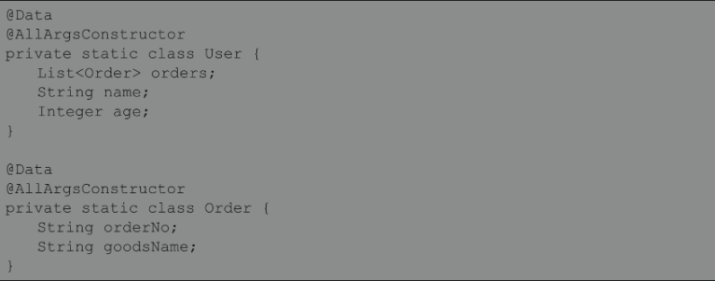

# 工具类

## SQL

        `SQL`工具类。可以很方便地在`Java`代码中动态构建`SQL`语句。

```java
//SELECT id,name FROM user WHERE (id = #{id} AND name = #{name}) 
// OR (name is null)
SQL sql = new SQL(){{
            SELECT("id,name");
            FROM("user");
            WHERE("id = #{id}");
            WHERE("name = #{name}");
            OR();
            WHERE("name is null");
}};
```

        `SQL`继承自`AbstractSQL`只重写了该类的`getSelf()`方法：

```java
public class SQL extends AbstractSQL<SQL> {
  @Override
  public SQL getSelf() {
    return this;
  }
}
```

        `AbstractSQL`类中维护了一个`SQLStatement`内部类的实例和一系列构造`SQL`语

句的方法。

```java
public abstract class AbstractSQL<T> {

  private static final String AND = ") \nAND (";
  private static final String OR = ") \nOR (";

  private final SQLStatement sql = new SQLStatement();

  public abstract T getSelf();

  public T SELECT(String... columns) {
    sql().statementType = SQLStatement.StatementType.SELECT;
    sql().select.addAll(Arrays.asList(columns));
    return getSelf();
  }

  public T SELECT_DISTINCT(String columns) {
    sql().distinct = true;
    SELECT(columns);
    return getSelf();
  }

  ...
}
```

        `SQLStatement`内部类用于描述一个`SQL`语句，该类中通过`StatementType`确定

SQL语句的类型。`SQLStatement`类中还维护了一系列的`ArrayList`属性，当调用

`SELECT(、UPDATE()`等方法时，这些方法的参数内容会记录在这些`ArrayList`对象

中：

```java
private static class SQLStatement {

    public enum StatementType {
      DELETE, INSERT, SELECT, UPDATE
    }

    StatementType statementType;
    List<String> sets = new ArrayList<>();
    List<String> select = new ArrayList<>();
    List<String> tables = new ArrayList<>();
    List<String> join = new ArrayList<>();
    List<String> innerJoin = new ArrayList<>();
    List<String> outerJoin = new ArrayList<>();
    List<String> leftOuterJoin = new ArrayList<>();
    List<String> rightOuterJoin = new ArrayList<>();
    List<String> where = new ArrayList<>();
    List<String> having = new ArrayList<>();
    List<String> groupBy = new ArrayList<>();
    List<String> orderBy = new ArrayList<>();
    List<String> lastList = new ArrayList<>();
    List<String> columns = new ArrayList<>();
    List<List<String>> valuesList = new ArrayList<>();
    boolean distinct;
    String offset;
    String limit;

    ...
}
```

        `AbstrastSQL`类重写了`toString()`方法，该方法中会调用`SQLStatement`对象

的`sql()`方法生成`SQL`字符串：

```java
// AbstractSQL 类
public String toString() {
    StringBuilder sb = new StringBuilder();
    sql().sql(sb);
    return sb.toString();
}
```

```java
// SQLStatement 类
public String sql(Appendable a) {
      SafeAppendable builder = new SafeAppendable(a);
      if (statementType == null) {
        return null;
      }

      String answer;

      switch (statementType) {
        case DELETE:
          answer = deleteSQL(builder);
          break;

        case INSERT:
          answer = insertSQL(builder);
          break;

        case SELECT:
          answer = selectSQL(builder);
          break;

        case UPDATE:
          answer = updateSQL(builder);
          break;

        default:
          answer = null;
      }

      return answer;
}


private String selectSQL(SafeAppendable builder) {
      // 追加 select 子句
      if (distinct) {
        sqlClause(builder, "SELECT DISTINCT", select, "", "", ", ");
      } else {
        sqlClause(builder, "SELECT", select, "", "", ", ");
      }
      // 追加 from 子句
      sqlClause(builder, "FROM", tables, "", "", ", ");
      // 追加 join 子句
      joins(builder);
      // 追加 where 子句
      sqlClause(builder, "WHERE", where, "(", ")", " AND ");
      // 追加 group by 子句
      sqlClause(builder, "GROUP BY", groupBy, "", "", ", ");
      // 追加 having 子句
      sqlClause(builder, "HAVING", having, "(", ")", " AND ");
      // 追加 order by 子句
      sqlClause(builder, "ORDER BY", orderBy, "", "", ", ");
      limitingRowsStrategy.appendClause(builder, offset, limit);
      return builder.toString();
}


private void sqlClause(SafeAppendable builder, String keyword, List<String> parts, String open, String close,
                           String conjunction) {
      if (!parts.isEmpty()) {
        if (!builder.isEmpty()) {
          builder.append("\n");
        }
        // 拼接 SQL 关键字
        builder.append(keyword);
        builder.append(" ");
        // 拼接关键字后开始字符
        builder.append(open);
        String last = "________";
        for (int i = 0, n = parts.size(); i < n; i++) {
          String part = parts.get(i);
          // 如果 SQL 关键字对应的子句内容不为 or 或 and ，则追加连接关键字
          if (i > 0 && !part.equals(AND) && !part.equals(OR) && !last.equals(AND) && !last.equals(OR)) {
            builder.append(conjunction);
          }
          // 追加子句内容
          builder.append(part);
          last = part;
        }
        // 追加关键字后结束字符
        builder.append(close);
      }
}
```

## ScriptRunner

        `ScriptRunner`工具类用于读取脚本文件中的`SQL`语句并执行。`ScriptRunner`

工具类的构造方法需要一个`java.sql.Connection`对象作为参数。创建

`ScriptRunner`对象后，调用该对象的`runScript()`方法即可，该方法接收一个读取

`SQL`脚本文件的`Reader`对象作为参数：

```java
try {
    Connection con = DriverManager.getConnection("jdbc:mysql://127.0.0.1:3306/db", "root", "123456");
    ScriptRunner runner = new ScriptRunner(con);
    runner.runScript(Resources.getResourceAsReader("xxx.sql"));
}
catch (Exception e){
    e.printStackTrace();
}
```

        `ScriptRunner`工具类中提供了一些属性，用于控制执行`SQL`脚本的一些行为：

```java
public class ScriptRunner {

  // SQL 异常是否中断程序执行
  private boolean stopOnError;

  // 是否抛出 SQLWarning 警告
  private boolean throwWarning;

  // 是否自动提交
  private boolean autoCommit;

  // 为 true ，批量执行文件中的 SQL 语句
  // 为 false，逐条执行 SQL 语句，默认情况下，SQL 语句以分号分隔
  private boolean sendFullScript;

  // 是否去除 Windows 系统换行符中的 \r
  private boolean removeCRs;

  // 设置 Statement 属性是否支持转义处理
  private boolean escapeProcessing = true;
  // 日志输出位置
  private PrintWriter logWriter = new PrintWriter(System.out);

  // 错误日志输出位置
  private PrintWriter errorLogWriter = new PrintWriter(System.err);
  // 脚本中 SQL 语句的分隔符，默认为分号
  private String delimiter = DEFAULT_DELIMITER;

  // 是否支持 SQL 语句分隔符单独占一行
  private boolean fullLineDelimiter;

  ...
}
```

        上面的属性，可以使用对应的 `Setter`方法来设置。`ScriptRunner`仅提供了一个

`runScript`方法用于执行`SQL`脚本文件：

```java
// ScriptRunner 类
public void runScript(Reader reader) {
    // 设置事务是否自动提交
    setAutoCommit();

    try {
      if (sendFullScript) {
        // 一次性批量执行
        executeFullScript(reader);
      } else {
        // 逐条执行
        executeLineByLine(reader);
      }
    } finally {
      rollbackConnection();
    }
}


private void executeLineByLine(Reader reader) {
    StringBuilder command = new StringBuilder();
    try {
      BufferedReader lineReader = new BufferedReader(reader);
      String line;
      while ((line = lineReader.readLine()) != null) {
        // 处理每行内容
        handleLine(command, line);
      }
      commitConnection();
      checkForMissingLineTerminator(command);
    } catch (Exception e) {
      String message = "Error executing: " + command + ".  Cause: " + e;
      printlnError(message);
      throw new RuntimeSqlException(message, e);
    }
}


private void handleLine(StringBuilder command, String line) throws SQLException {
    String trimmedLine = line.trim();
    // 判断该行是否是 SQL 注释
    if (lineIsComment(trimmedLine)) {
      Matcher matcher = DELIMITER_PATTERN.matcher(trimmedLine);
      if (matcher.find()) {
        delimiter = matcher.group(5);
      }
      println(trimmedLine);
    }
    // 判断该行是否包含分号 
    else if (commandReadyToExecute(trimmedLine)) {
      // 获取分号之前的内容
      command.append(line, 0, line.lastIndexOf(delimiter));
      command.append(LINE_SEPARATOR);
      println(command);
      // 执行完整的 SQL 语句
      executeStatement(command.toString());
      command.setLength(0);
    }
    // 不包含分号，说明 SQL 语句未结束，追加到本行内容到之前读取的内容中 
    else if (trimmedLine.length() > 0) {
      command.append(line);
      command.append(LINE_SEPARATOR);
    }
}
```

## SqlRunner

        `SqlRunner`工具类对`JDBC`做了很好的封装，结合`SQL`工具类，能够很方便地通过

`Java`代码执行`SQL`语句并检索`SQL`执行结果。

        方法：

                `closeConnection`：用于关闭`Connection`对象。

                `selectOne`：执行`SELECT`语句，`SQL`语句中可以使用占位符，如果`SQL`

        中包含占位符，则可变参数用于为参数占位符赋值，该方法只返回一条记录。若查询结

        果行数不等于一，则会抛出`SQLException`异常。

                `selectAll`：该方法和`selectOne()`方法的作用相同，只不过该方法可以返

        回多条记录，方法返回值是一个`List`对象，`List`中包含多个`Map`对象，每个

        `Map`对象对应数据库中的一行记录。

                `insert`：执行一条`INSERT`语句，插入一条记录。

                `update`：更新若干条记录。

                `delete`：删除若干条记录。

                `run`：执行任意一条`SQL`语句，最好为`DDL`语句。

```java
// SqlRunner 类
public List<Map<String, Object>> selectAll(String sql, Object... args) throws SQLException {
    try (PreparedStatement ps = connection.prepareStatement(sql)) {
      // 设置 SQL 中的占位符
      setParameters(ps, args);
      // 执行查询操作
      try (ResultSet rs = ps.executeQuery()) {
        // 将查询结果转化为 List
        return getResults(rs);
      }
    }
}


private void setParameters(PreparedStatement ps, Object... args) throws SQLException {
    for (int i = 0, n = args.length; i < n; i++) {
      if (args[i] == null) {
        throw new SQLException("SqlRunner requires an instance of Null to represent typed null values for JDBC compatibility");
      } else if (args[i] instanceof Null) {
        ((Null) args[i]).getTypeHandler().setParameter(ps, i + 1, null, ((Null) args[i]).getJdbcType());
      } else {
        // 根据参数类型获取对应的 TypeHandler
        TypeHandler typeHandler = typeHandlerRegistry.getTypeHandler(args[i].getClass());
        if (typeHandler == null) {
          throw new SQLException("SqlRunner could not find a TypeHandler instance for " + args[i].getClass());
        } else {
          // 为占位符赋值
          typeHandler.setParameter(ps, i + 1, args[i], null);
        }
      }
    }
}


private List<Map<String, Object>> getResults(ResultSet rs) throws SQLException {
    List<Map<String, Object>> list = new ArrayList<>();
    List<String> columns = new ArrayList<>();
    List<TypeHandler<?>> typeHandlers = new ArrayList<>();
    // 获取 ResultSetMetaData 对象，通过 ResultSetMetaData 获取所有列名
    ResultSetMetaData rsmd = rs.getMetaData();
    for (int i = 0, n = rsmd.getColumnCount(); i < n; i++) {
      columns.add(rsmd.getColumnLabel(i + 1));
      try {
        // 获取类的 JDBC 类型
        Class<?> type = Resources.classForName(rsmd.getColumnClassName(i + 1));
        // 根据类型获取对应的 TypeHandler
        TypeHandler<?> typeHandler = typeHandlerRegistry.getTypeHandler(type);
        if (typeHandler == null) {
          typeHandler = typeHandlerRegistry.getTypeHandler(Object.class);
        }
        typeHandlers.add(typeHandler);
      } catch (Exception e) {
        typeHandlers.add(typeHandlerRegistry.getTypeHandler(Object.class));
      }
    }
    // 遍历 ResultSet
    while (rs.next()) {
      Map<String, Object> row = new HashMap<>();
      // 将记录行转换为 Map 对象
      for (int i = 0, n = columns.size(); i < n; i++) {
        String name = columns.get(i);
        TypeHandler<?> handler = typeHandlers.get(i);
        // 通过 TypeHandler 将 JDBC 类型转换为 Java 类型
        row.put(name.toUpperCase(Locale.ENGLISH), handler.getResult(rs, name));
      }
      list.add(row);
    }
    return list;
}
```

## MetaObject

        `MetaObject`是`MyBatis`中的反射工具类。使用`MetaObject`工具类，可以很优

雅地获取和设置对象的属性值。




## MetaClass

        `MetaClass`是`MyBatis`中的反射工具类，与`MetaOjbect`不同的是，

`MetaObject`用于获取和设置对象的属性值，而`MetaClass`则用于获取类相关的信息。


## ObjectFactory

        `ObjectFactory`是`MyBatis`中的对象工厂，`MyBatis`每次创建`Mapper`映射结

果对象的新实例时，都会使用一个对象工厂实例来完成。`ObjectFactory`接口只有一个默

认的实现，即`DefaultObjectFactory`，默认的对象工厂需要做的仅仅是实例化目标

类，要么通过默认构造方法，要么在参数映射存在的时候通过参数构造方法来实例化。

        `ObjectFactory`是`MyBatis`提供的一种扩展机制。有些情况下，在得到映射结果

之前需要处理一些逻辑，或者在执行该类的有参构造方法时，在传入参数之前，要对参数进

行一些处理，这时可以通过自定义`ObjectFactory`来实现。


## ProxyFactory

        `ProxyFactory`是`MyBatis`中的代理工厂，主要用于创建动态代理对象，

`ProxyFactory`接口有两个不同的实现，分别为`CglibProxyFactory`和

`JavassistProxyFactory`。从实现类的名称可以看出，`MyBatis`支持两种动态代理策

略，分别为`Cglib`和`Javassist`动态代理。`ProxyFactory`主要用于实现`MyBatis`

的懒加载功能。当开启懒加载后，`MyBatis`创建`Mapper`映射结果对象后，会通过

`ProxyFactory`创建映射结果对象的代理对象。当我们调用代理对象的`Getter`方法获取

数据时，会执行`CglibProxyFactory`或`JavassistProxyFactory`中定义的拦截逻

辑，然后执行一次额外的查询。


